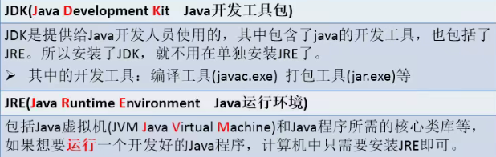
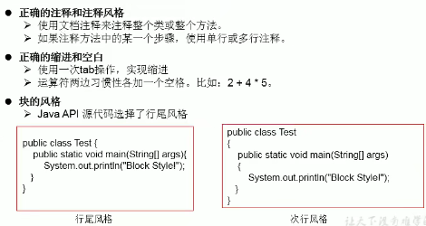

# Java 语言概述

## 1.软件开发介绍

- **软件开发**： 一系列按照特定顺序组织的计算机数据和指令的集合。
- **人机交互方式**：
  - 图形化界面（GUI)
  - 命令行方式(CLI)

- **常用的DOS命令**：
  - dir: 列出当前目录下的文件及文件夹
  - md: 创建目录
  - rd: 删除目录
  - cd: 进入指定目录
  - cd..: 退回到上级目录 
  - cd\: 退回到根目录
  - del: 删除文件
  - exit: 退出

## 2.计算机编程语言介绍

- 第一代语言：机器语言

- 第二代语言：汇编语言

- 第三代语言：高级语言

  

## 3.Java语言概述

- TIOBE

- java之父James Gosling

- SUN，斯坦福大学网络公司，1995

- 

- Java技术体系平台

  

  

## 4.运行机制及运行过程

- **语言特点**：

  - 面向对象
    - 两个基本概念：类、对象
    - 三大特性：封装、继承、多态

  - 健壮性
  - 跨平台性

- **两种核心机制**：
  - Java虚拟机（Java Virtal Machine)
  - 垃圾收集机制

## 5.Java的环境搭建

- **什么是JDK、JRE**
  - 
  - 
  - 

## 6.开发体验--HelloWorld

- 

- 

  

## 7.注释（Comment)

- **单行注释**:

  - //comment

- **多行注释**:

  - /*

  ​       comment

  ​         */

- **文档注释**:

  - /**

  ​       comment

  ​        */

  - 区别：

  - 操作方式：

## 8.良好的编程风格

## 9.常用的Java开发工具

- 

- 

  