# Java基本语法

## 1.关键字和保留字

- **关键字**：被Java语言赋予了特殊含义，用做专门用途的字符串（单词）

  - 特点：关键字所有字母都为小写

  - 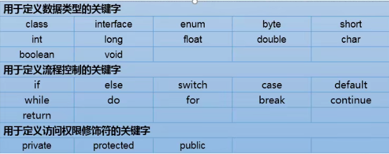

    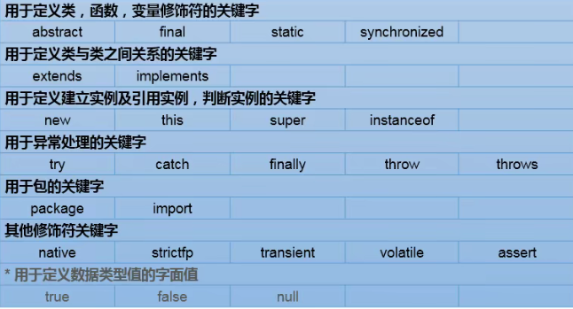

- **保留字**（reserved word）：现有的Java版本尚未使用，但以后的版本可能会作为关键字使用。自己命名标识符时要避免使用这些保留字。

  

## 2.标识符

- **定义**：Java对各种变量、方法和类等要素命名时使用的字符序列。
- **定义合法标识符规则**：
  - 由26个英文字母大小写，0-9，_或￥组成
  - 数字不可以开头
  - 不可以使用关键字和保留字，但能包含关键字和保留字
  - 严格区分大小写，长度无限制
  - 标识符不能包含空格
- **Java中的名称命名规范**：
  - 包名： 多单词组成时所有字母小写，xxxyyyzz
  - 类名、接口名： 多单词组成时，第一个单词首字母小写，第二个单词开始每个首字母大写，xxxYyyZzz
  - 常量名： 所有字母都大写。多单词时用下划线链接，XXX_YYY_ZZZ

## 3.变量

- **定义**：

  - 内存中的一个存储区域
  - 该区域的数据可以在同一类型范围内不断变化
  - 变量是程序中最基本的存储单元。包含变量类型、变量名和存储的值。

- **作用**：

  - 用于在内存中保存数据

- **注意**：

  - Java 中每个变量必须先声明，后使用；
  - 使用变量名来访问这块区域的数据；
  - 变量的作用域：其定义所在的一对{ }内；
  - 变量只有在其作用域内才有效；
  - 同一个作用域内，不能定义重名的变量；

- **按数据类型分**：

  - 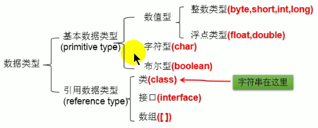

  - Java 各整数类型有固定的表数范围和字段长度，不受具体 OS 的影响，以保证 java 程序的可移植性。

  - java 的整型常量默认为 int 型，声明 long 型常量须后加‘l’或‘L’

  - java 程序中变量通常声明为 int 型，除非不足以表示较大的数，才使用 long

  - 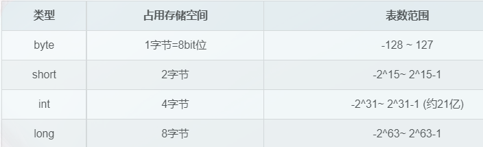

    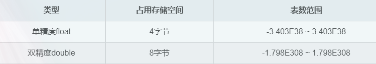

    

- **按变量在类中声明的位置**:

  - 成员变量：在方法体外，类体内声明的变量

  - 局部变量： 在方法体内部声明的变量

  - 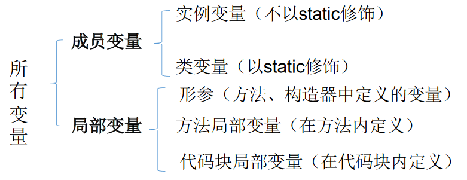

  - 同：都有生命周期

    异：局部变量除形参外，需显式初始化。

- **字符集**：

  - ASCII 码
  - Unicode 编码
  - UTF-8

- **布尔类型**：

  - 用来判断逻辑条件
  - 只允许取值true和false，无null，不可以使用0或非0 的整数替代false和true，这点和C语言不同。
  - Java虚拟机中没有任何供boolean值专用的字节码指令，Java语言表达所操作的boolean值，在编译之后都使用java虚拟机中的int数据类型来代替：true用1表示，false用0表示。———《java虚拟机规范8版》

- **字符串类型：String**

  - String不是基本数据类型，属于引用数据类型
  - 使用方式与基本数据类型一致。例如：String str= “abcd”;
  - 一个字符串可以串接另一个字符串，也可以直接串接其他类型的数据。
  - 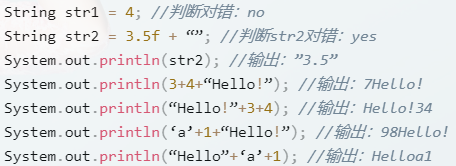

- **基本数据类型转换**：

  - 自动类型转换：容量小的类型自动转换为容量大的数据类型。数据类型按容量大小排序为：

    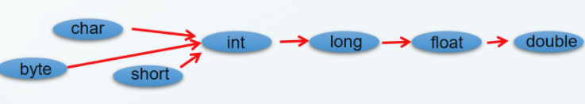

  - 有多种类型的数据混合运算时，系统首先自动将所有数据转换成容量最大的那种数据类型，然后再进行计算。

  - byte,short,char之间不会相互转换，他们三者在计算时首先转换为int类型。

  - boolean类型不能与其它数据类型运算。

  - 当把任何基本数据类型的值和字符串(String)进行连接运算时(+)，基本数据类型的值将自动转化为字符串(String)类型。

- **强制类型转换**

  - 自动类型转换的逆过程，将容量大的数据类型转换为容量小的数据类型。使用时要加上强制转换符：()，但可能造成精度降低或溢出,格外要注意。
  - 通常，字符串不能直接转换为基本类型，但通过基本类型对应的包装类则可以实现把字符串转换成基本类型。
  - 如：String a = “43”; inti= Integer.parseInt(a);
    boolean类型不可以转换为其它的数据类型。

- **进制与进制间的转换**：

  - 所有数字在计算机底层都以二进制形式存在。
    对于整数，有四种表示方式：
    - 二进制(binary)：0,1 ，满2进1.以0b或0B开头。
    - 十进制(decimal)：0-9 ，满10进1
    - 八进制(octal)：0-7 ，满8进1. 以数字0开头表示
    - 十六进制(hex)：0-9及A-F，满16进1. 以0x或0X开头表示。此处的A-F不区分大小写。如：0x21AF +1= 0X21B0

## 4.运算符

- 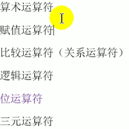

- **算数运算符**

  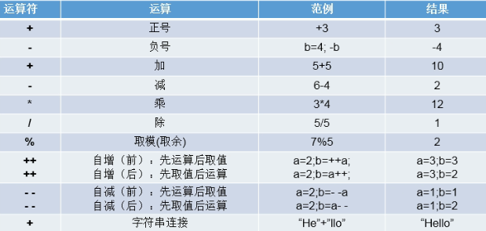

- **赋值运算符**

  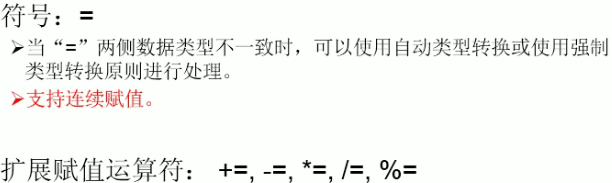

- **比较运算符**

  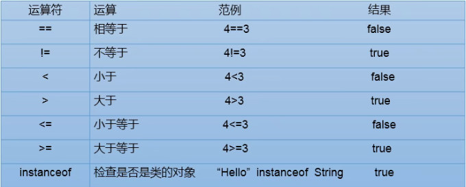

- **逻辑运算符**

  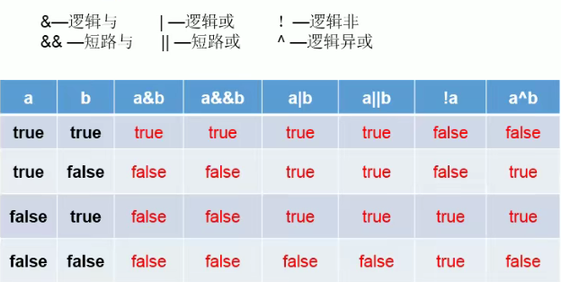

- **位运算符**

  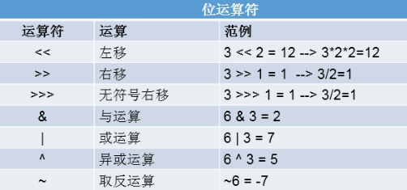

- **三元运算符**

  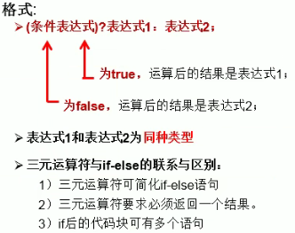

- **运算符的优先级**

  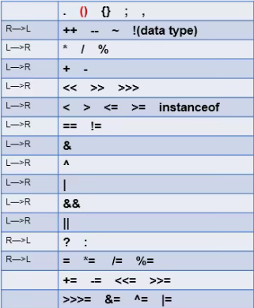

  

## 5.程序流程控制

- **流程控制语句**是用来控制程序中各语句执行顺序的语句，可以把语句组合成能完成一定功能的小逻辑模块.

- **顺序结构**:

  程序从上到下逐行地执行，中间没有任何判断和跳转.

- **分支结构:**

  - 根据条件，选择性地执行某段代码。
  - 有`if…else`和`switch-case`两种分支语句。

- **循环结构**:

  - 根据循环条件，重复性的执行某段代码。
  - 有`while、do…while、for`三种循环语句。
  - 注：JDK1.5提供了`foreach`循环，方便的遍历集合、数组元素.

- **嵌套循环**

- **break、continue的使用**

  - break语句用于终止某个语句块的执行
  - break语句出现在多层嵌套的语句块中时，可以通过标签指明要终止的是哪一层语句块
  - continue只能使用在循环结构中
  - continue语句用于跳过其所在循环语句块的一次执行，继续下一次循环
  - continue语句出现在多层嵌套的循环语句体中时，可以通过标签指明要跳过的是哪一层循环

- **return的使用：**

  - return：并非专门用于结束循环的，它的功能是结束一个方法。当一个方法执行到一个return语句时，这个方法将被结束。
  - 与break和continue不同的是，return直接结束整个方法，不管这个return处于多少层循环之内。

- **特殊流程控制语句说明:**

  - break只能用于switch语句和循环语句中。

  - continue 只能用于循环语句中。

  - 二者功能类似，但continue是终止本次循环，break是终止本层循环。

  - break、continue之后不能有其他的语句，因为程序永远不会执行其后的语句

  - 标号语句必须紧接在循环的头部。标号语句不能用在非循环语句的前面。

  - 很多语言都有goto语句，goto语句可以随意将控制转移到程序中的任意一条语句上，然后执行它。但使程序容易出错。Java中的break和continue是不同于goto的。

    

- **使用Scanner从键盘获取值**

  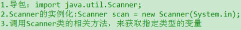

  