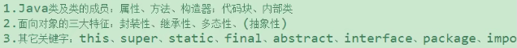
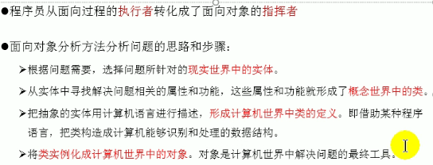
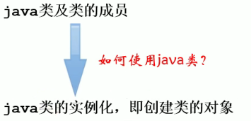
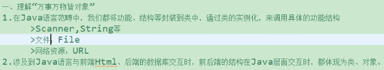
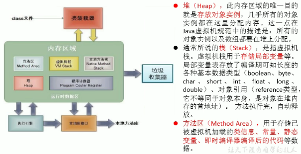
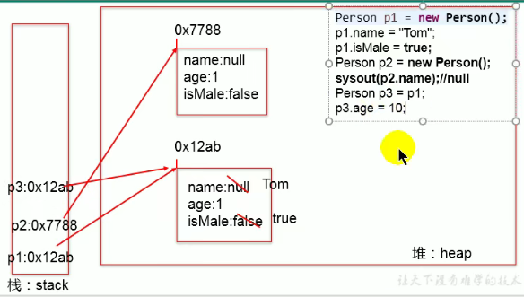
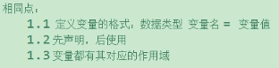
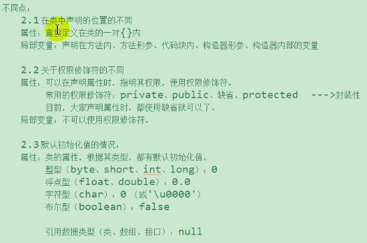
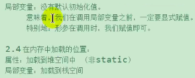

# 面向对象

## 1.学习面向对象三条主线

- 


## 2.面向过程与面向对象

- 二者都是一种思想，面向对象(OOP)是相对于面向过程(POP)而言的。

  面向过程：强调的是功能行为，以函数为最小单位，考虑怎么做。

  

  面向对象：更加强调运用人类在日常的思维逻辑中采用的思想方法与原则，如抽象、分类、继承、聚合、多态等。

  

  面向对象：将功能封装进对象，强调具备了功能的对象，以类/对象为最小单位，考虑谁来做。

- 面向对象的三大特征：

  - 封装（Encapsulation)
  - 继承(Inheritance)
  - 多态(Polymorphism)

- 


## 3.Java基本元素：类和对象

#### 1.概念

- 类：是对一类事物的描述，是抽象的、概念的定义
- 对象：是实际存在的该类事物的每个个体，因而也称为实例。
- 面向对象程序设计的重点是类的设计——类的成员设计

#### 2.Java类及类成员

- 属性：对应类中的成员变量

- 行为：对应类中的方法

- 类的实例化：

  

- ```java
  public class PersonTest{
      public static void main(String[] args){
          Person person = new Person();
          person.name = "tom";
          System.out.println(person.name);
          person.eat();
          //将person对象的地址赋给p1，都指向了堆空间中的同一实体
          Person p1 = new Person();
          System.out.println(p1.name);//tom
      }
  }
  class Person{
      String name;
      int age = 1;
      boolean isMale;
      public void eat(){
          System.out.println("eat");
      }
  }
  ```

- 如果创建了一个类的多个对象，则每个对象都独立拥有一套类的属性（非static）。

- 

#### 3..对象的内存解析

- 

- 

- 《JVM规范》
- 虚拟机栈：栈结构，我们将局部变量存储在栈结构中
- 堆：我们将new出来的结构（比如数组、对象）加载在空间中。（对象的属性（非static）加载在堆空间中）
- 方法区：类的加载信息、常量池、静态域

#### 4.匿名对象

- 
- 我们创建的对象，没有显式的赋给一个变量名。
- 特征：匿名对象只能调用一次
- 使用：

## 4.类的成员之一：属性

- 属性（成员变量）vs 局部变量

  - 

  - 

  - 

    

## 5.类的成员之二：方法

- 声明：权限修饰符 返回值类型 方法名（形参列表）{方法体}
  - 权限修饰符：private public 缺省 protected
  - 返回值类型：
    - 有返回值
    - 没返回值
  - 方法名：遵循标识符的规则规范
- return关键字的使用
  - 适用范围：方法体中
  - 作用：结束方法，针对有返回值类型的方法，返回所要的数据
  - return关键字后面不可以声明执行语句

- 方法的使用中，可以调用当前类的属性或方法

  方法中，不能定义方法


 ## 6.OOP特征一：封装与隐藏


## 7.类的成员之三：构造器


## 8.关键字：this


## 9.关键字：package,import


