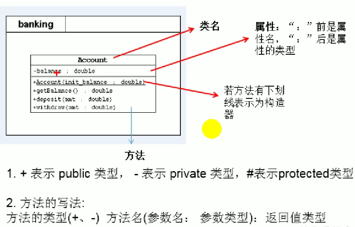

# 面向对象

## 1.学习面向对象三条主线

- 


## 2.面向过程与面向对象

- 二者都是一种思想，面向对象(OOP)是相对于面向过程(POP)而言的。

  面向过程：强调的是功能行为，以函数为最小单位，考虑怎么做。

  

  面向对象：更加强调运用人类在日常的思维逻辑中采用的思想方法与原则，如抽象、分类、继承、聚合、多态等。

  

  面向对象：将功能封装进对象，强调具备了功能的对象，以类/对象为最小单位，考虑谁来做。

- 面向对象的三大特征：

  - 封装（Encapsulation)
  - 继承(Inheritance)
  - 多态(Polymorphism)

- 


## 3.Java基本元素：类和对象

#### 1.概念

- 类：是对一类事物的描述，是抽象的、概念的定义
- 对象：是实际存在的该类事物的每个个体，因而也称为实例。
- 面向对象程序设计的重点是类的设计——类的成员设计

#### 2.Java类及类成员

- 属性：对应类中的成员变量

- 行为：对应类中的方法

- 类的实例化：

  

- ```java
  public class PersonTest{
      public static void main(String[] args){
          Person person = new Person();
          person.name = "tom";
          System.out.println(person.name);
          person.eat();
          //将person对象的地址赋给p1，都指向了堆空间中的同一实体
          Person p1 = new Person();
          System.out.println(p1.name);//tom
      }
  }
  class Person{
      String name;
      int age = 1;
      boolean isMale;
      public void eat(){
          System.out.println("eat");
      }
  }
  ```

- 如果创建了一个类的多个对象，则每个对象都独立拥有一套类的属性（非static）。

- 

#### 3..对象的内存解析

- 

- 

- 《JVM规范》
- 虚拟机栈：栈结构，我们将局部变量存储在栈结构中
- 堆：我们将new出来的结构（比如数组、对象）加载在空间中。（对象的属性（非static）加载在堆空间中）
- 方法区：类的加载信息、常量池、静态域

#### 4.匿名对象

- 
- 我们创建的对象，没有显式的赋给一个变量名。
- 特征：匿名对象只能调用一次
- 使用：

## 4.类的成员之一：属性

- 属性（成员变量）vs 局部变量

  - 

  - 

  - 

    

## 5.类的成员之二：方法

- 声明：权限修饰符 返回值类型 方法名（形参列表）{方法体}
  - 权限修饰符：private public 缺省 protected
  - 返回值类型：
    - 有返回值
    - 没返回值
  - 方法名：遵循标识符的规则规范
  
- return关键字的使用
  - 适用范围：方法体中
  - 作用：结束方法，针对有返回值类型的方法，返回所要的数据
  - return关键字后面不可以声明执行语句

- 方法的使用中，可以调用当前类的属性或方法

  方法中，不能定义方法

#### 1.再谈方法

- **方法的重载（overload)**

  - 概念：在同一个类中，允许存在一个以上的同名方法，只要它们的参数个数或者参数类型不同即可。

  - 特点： 与返回值类型无关，只看参数列表，且参数列表必须不同（参数个数或者参数类型）。调用时，根据方法参数列表的不同来区别。

  - 示例：

    ```java
    public class OverloadExer {
        public void main(int i){
            System.out.println(i * i);
        }
        public void main(int i, int j){
            System.out.println(i * j);
        }
        public void main(String s){
            System.out.println(s);
        }
    }
    ```

    

- **可变形参的方法**

  - JavaSE5.0中提供了Varargs(variable number of arguments)机制，允许直接定义能和多个实参相匹配的形参。从而，可以用一种更简单的方式，来传递个数可变的实参。
  - 
  - 可变个数形参的格式： 数据类型 ... 变量名
  - 当调用可变个数形参的方法时，传入的参数个数可以是：0， 1， 2....个
  - 可变个数形参方法与本类中方法名相同，形参不同的方法之间构成重载。
  - 可变个数形参在方法的形参中，最多只能声明一个，并必须在末尾
  - 

- **方法参数的值传递机制**

  - 如果数据是基本数据类型，此时赋值的时变量所保存的数据值

  - 如果变量是引用数据类型，此时赋值的是变量所保存的数据的地址值

  - 

    ```java
    public static void method(int a, int b){
        a = a * 10;
        b = b * 20;
        System.out.println(a);
        System.out.println(b);
        System.exit(0);
    }
    //法2
    public static void method(int a, int b){
        PrintStream ps = new PrintStream(System.out){
            @override
            public void println(String x){
                if("a=10".equals(x)){
                    x = "a=100";
                }else if("b=10".equals(x)){
                    x = "b=200"
                }
                super.println(x);
            }
        };
        System.setOut(ps);
    }
    ```

  - 练习：

    ```java
    public class Circle {
        double radius;
        public static void main(String[] args){
            PassObject test = new PassObject();
            Circle c = new Circle();
            test.printAreas(c, 5);
            System.out.println((c.radius));
        }
        public double findArea(){
            return Math.PI * radius * radius;
        }
    }
    class PassObject{
        public void printAreas(Circle c, int time){
            for(int i = 1; i <= time; i++){
                c.radius = i;
                System.out.println(c.findArea());
            }
        }
    }
    ```

    

- **递归方法**

  - 一个方法体内调用它自身

    ```java
    public class RecursionTest {
        public static void main(String[] args) {
            /**
            int sum = 0;
            for(int i = 1; i <= 100; i++){
                sum += i;
            }
             **/
            RecursionTest test = new RecursionTest();
            int sum = test.getSum(100);
            System.out.println(sum);
        }
        public int getSum(int n){
            if(n == 1){
                return 1;
            }else{
                return n + getSum(n - 1);
            }
        }
    ```

  - 

    ```java
    public int f(int n){
        if(n == 0){
            return 1;
        }else if(n == 1){
            return 4;
        }else{
            return 2 * f(n - 1) + f(n - 2);
        }
    }
    ```

  - 斐波那契数列（Fibonacci）

    ```java
    public class Solution {
        public int Fibonacci(int n) {
            if(n == 0) {
                return 0;
            }
            if(n == 1) {
                return 1;
            }
            return Fibonacci(n-1) + Fibonacci(n-2);
        }
    }
    ```

    

 ## 6.OOP特征一：封装与隐藏

- 高内聚：类的内部数据操作细节自己完成，不允许外部干涉
- 低耦合：仅对外暴露少量的方法用于使用

- 封装性的体现：

  - 我们将类的属性xxx私有化（private），同时，提供公共的（public）方法来获取（getXXX）和设置（setXXX）此属性。
  - 不对外暴露私有的方法
  - 单例模式（将构造器私有化）...

- 四种权限修饰符

  - 

  - 4种权限可以用来修饰类及类的内部结构、属性、方法、构造器、内部类

      修饰类的话，只能使用，缺省、public

- 属性赋值的先后顺序：

  

  

  

## 7.类的成员之三：构造器（构造方法）

- 作用：
  - 创造对象
  - 给对象初始化
- 如果**没有**显式的定义类的构造器的话，则系统默认提供一个空参的构造器
- 格式：权限修饰符 类名（形参列表）{}
- 一个类中定义多个构造器，彼此构成重载


## 8.JavaBean

- JavaBean是一种Java语言写成的可重用组件

- 所谓javaBean，是指符合如下标准的Java类

  - 类是公共的
  - 有一个无参的公共的构造器
  - 有属性，且有对应的get、set方法

- 用户可以使用JavaBean将功能、处理、值、数据库访问和其他任何可以用Java代码创造的对象进行打包，并且其他的开发者可以通过内部JSP页面、Servlet、其他javaBean、applet程序或者应用来使用这些对象。

- ```java
  public class JavaBean {
      private int id;
      private String name;
      public JavaBean(){
          
      }
  
      public int getId() {
          return id;
      }
  
      public void setId(int id) {
          this.id = id;
      }
  
      public String getName() {
          return name;
      }
  
      public void setName(String name) {
          this.name = name;
      }
  }
  ```

## 9.UML类图




## 10.关键字：this

- 使用：可以用来修饰、调用，属性、方法、构造器
- this修饰属性方法理解为：当前对象 或当前正在创建的对象
- 通常情况下，我们都选择省略“this.”。特殊情况下，如果方法的形参和类的属性名同名时，我们必须显式的使用“this.变量”的方式，表明为属性，而非形参。
- 调用构造器
  - 
  - 
  - 

## 11.关键字：package,import

- **package：**

  - 为了更好的实现项目中类的管理，提出包的概念
  - 使用package声明类或接口所属的包，声明在源文件的首行
  - 包，属于标识符，遵循标识符的命名规则规范
  - 每“.”一次，就代表一层文件目录
  - 同一个包下不可以命名同名的接口、类。

- JDK中主要的包介绍

  

- **import**：

  - 在源文件中显式的使用import结构导入指定包下类、接口
  - 声明在包的声明和类的声明之间
  - 如果需要导入多个结构，则并列写出即可
  - java.lang包下定义的，可以省略import
  - 如果源文件中，使用了不同包下的同名类，则必须至少有一个类需要以全类名的方式显示
  - 使用“XXX.*”方式表明可以调用XXX包下的所有结构，但是如果使用的是XXX下的子包下的结构，则仍需要显式导入
  - import static ：导入指定类或接口中的静态结构

## 12.MVC设计模式


