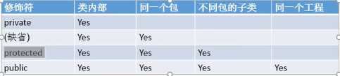
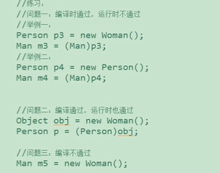
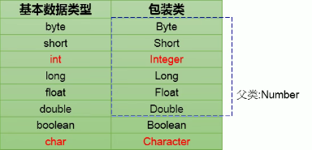
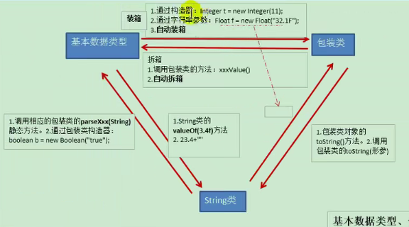
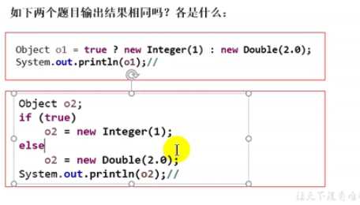
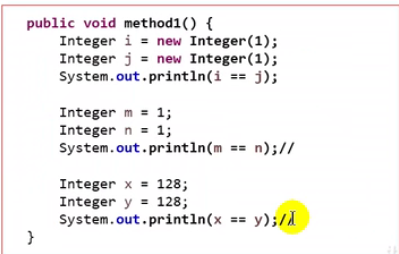

# 面向对象（中）


## 1. OOP特征二： 继承性


### 1.1 继承性的好处

- 减少代码冗余，提高代码复用性
- 便于功能的扩展
- 为之后多态性的使用，提供了前提


### 1.2 继承性的格式

- **class A extends B{}**

  - A : 子类、派生类、subclass
  - B: 父类、基类、超类、superclass

  

- <font color='orange'>体现</font>： 一旦子类A继承父类B后，子类A就获取了父类B声明的结构： 属性、方法

  - 特别地，父类声明为private的属性或方法，子类继承父类以后，仍然认为获取了父类中私有结构，只是因为 *封装性* 的影响，使得子类不能直接调用父类的结构而已
  - 子类继承父类以后，还可以声明自己特有的属性或方法，实现功能的拓展


### 1.3 Java中关于继承性的规定

- Java只支持单继承和多层继承，不允许多重继承
  - 一个子类只能有一个父类
  - 一个父类可以派生出多个子类
  - 子父类是相对的概念
- 直接父类、间接父类

- 子类继承父类以后，就获取了直接父类以及所有间接父类中说声明的属性和方法


### 1.4 Object类

- 如果我们没有显式的声明一个类的父类的话，则此类继承于java.lang.Object类
- 所有类（除java.lang.Object类外）都直接或间接的继承java.lang.Object类
- 所有的java类都具有java.lang.Object类声明的功能


## 2. 方法的重写（override）

1. **定义**： 在子类中可以根据需要对父类中继承来的方法进行改造，也称为方法的重置、覆盖。程序执行时，子类的方法将<font color='green'>覆盖</font>父类的方法

    

2. **要求：**
   
   - 子类重写的方法必须和父类被重写的方法具有<font color='red'>相同的方法名称、参数列表</font>
   - 子类重写的方法<font color='purple'>返回值</font> *不能大于* 父类被重写的方法的返回值类型
     - 父类被重写的方法的返回值类型是void，则子类重写的方法的返回值类型只能是void
     - 父类被重写的方法的返回值类型是A类，则子类重写的方法的返回值类型只能是A类或A类的子类
     - 父类被重写的方法的返回值类型是基本数据类型，则子类重写的方法的返回值类型只能是相同的数据类型
   - 子类重写的方法使用的<font color='purple'>访问权限</font> *不能小于* 父类被重写的方法访问权
   - 子类不能重写父类中声明为private权限的方法
   - 子类方法抛出的<font color='purple'>异常 </font>*不能大于* 父类被重写方法的异常
   
   
   
3. **注意：**

   - 子类与父类中同名同参数的方法必须同时声明为非static的（即为重写），或同时什么声明为static的（不是重写）。因为static方法是属于类的，子类无法覆盖父类的方法

   

4. 应用： 重写以后、当创建子类对象以后，通过子类对象调用子父类中的同名方法，==实际执行的是子类重写父类的方法==

    

5. 重写的规定：

   - 方法的声明： 权限修饰符 返回值类型 方法名（形参列表）{方法体}
   - 约定俗称： 子类中的叫重写的方法、父类中叫被重写的方法

   

6. **区分方法的重载和重写：**

   
   
   重载(Overloading)
   
   （1） 方法重载是让类以统一的方式处理不同类型数据的一种手段。多个同名函数同时存在，具有不同的参数个数/类型。
   
   重载Overloading是一个类中多态性的一种表现。
   
   （2） Java的方法重载，就是在类中可以创建多个方法，它们具有相同的名字，但具有不同的参数和不同的定义。
   
   调用方法时通过传递给它们的不同参数个数和参数类型来决定具体使用哪个方法, 这就是多态性。
   
   （3） 重载的时候，方法名要一样，但是参数类型和个数不一样，返回值类型可以相同也可以不相同。无法以返回型别作为重载函数的区分标准。
   
   重写（Overriding）
   
   （1） 父类与子类之间的多态性，对父类的函数进行重新定义。如果在子类中定义某方法与其父类有相同的名称和参数，我们说该方法被重写 (Overriding)。在Java中，子类可继承父类中的方法，而不需要重新编写相同的方法。
   
   但有时子类并不想原封不动地继承父类的方法，而是想作一定的修改，这就需要采用方法的重写。
   
   方法重写又称方法覆盖。
   
   （2）若子类中的方法与父类中的某一方法具有相同的方法名、返回类型和参数表，则新方法将覆盖原有的方法。
   
   如需父类中原有的方法，可使用super关键字，该关键字引用了当前类的父类。
   
   （3）子类函数的访问修饰权限不能少于父类的。


## 3.四种访问权限修饰符




## 4. 关键字： super

1. super理解为 *父类的*

    

2. super可以用来调用<font color='LightSeaGreen'>属性、方法、构造器</font>

    

3. 使用：
   - 在子类的方法或构造器中。通过”super.属性“或”super.方法“的方式，显式地调用父类中声明的属性或方法。通常省略super
   - 特殊情况，当子类和父类中定义了同名的属性时，我们想要在子类中调用父类中声明的属性，则必须是**显式**的使用super
   - 当子类重写了父类的方法也是一样
   - 我们可以在子类的构造器中显式的使用"super(形参列表)"的方式，调用父类中声明的指定的构造器
   - "super(形参列表)"的使用，必须声明在子类构造器的首行
   - 我们在类的构造器中，针对于==”this(形参列表)“或"super(形参列表)"只能二选一==
   - 在构造器的首行，没有显式的声明”this(形参列表)“或"super(形参列表)"，则默认调用的是父类中的<font color='DarkGoldenrod'>空参构造器</font>


## 5. 子类对象实例化过程

1. 从结果来看，（继承性)子类继承父类以后，就获取了父类中声明的属性或方法。创建子类的对象，在堆空间中，就会加载所有父类中声明的属性
2. 从过程来看，当我们通过子类的构造器创建子类对象时，我们一定会直接或间接的调用其父类的构造器，进而调用父类的父类的构造器，直到调用了java.lang.Object类中的空参构造器为止。正因为加载过所有的父类的结构，所以才可以看到内存中有父类中的结构，子类对象才可以考虑


## 6. OOP特征三：多态性

1. 理解多态性： *一个事物的多种形态*

    

2. 什么是多态？
   - 对象的多态性： 父类的引用指向子类的对象*(或子类的对象赋值给父类的引用)*
   
       
   
3. 多态的使用：当调用子父类同名同参数的方法时，实际执行的是子类重写父类的方法----<font color='DarkGoldenrod'>*虚拟方法调用*</font>
   - **编译看左，运行看右**
   
   - 我们在*编译期*，只能调用父类中声明的方法，但在*运行期*，我们实际执行的是子类重写父类的方法
   
       
   
4. **多态性的使用前提：**
   
   - 类的继承关系
   
   - 方法的重写
   
       
   
5. 对象的多态性，只适用于方法不适用于属性（编译和运行都看左边）

    

6. **虚拟方法调用：**
   
   - 子类中定义了与父类同名同参数的方法，在多态情况下，将此时父类的方法称为虚拟方法
   
       
   
7. **instanceof 操作符：**
   
   - 使用： a instanceof A :判断对象a是否是类A的实例，是返回true
   
       
   
8. **怎么调用子类特有的属性和方法**
   
   - 向下转型，使用强制类型转换
     - 使用强转时，可能出现ClassCastException的异常
     - 用instanceof先进行判断
   
   
   
9. 


## 7. Object类的使用

1. Object类是所有类的根父类

2. 如果在类的声明中未使用extends关键字指明其父类，则默认父类为java.lang.Object类

3. Object类中的功能(属性、方法)具有通用性

4. 属性: 无 

5. Object类只声明了一个空参的构造器

    

### 7.1 Object中的方法

```java
clone()

equals(Object obj)

finalize(): 对象被回收之前会调用这个方法

getClass()： 获取当前对象的所属类

hashCode(): 返回当前对象的哈希值

notify()

notifyAll()

toString()

wait()

wait(long timeout)

wait(long timeout， int nanos)
```


### 7.2 equals（）和 "==" 区别

1. **回顾 ”==“ 的使用**

   - 可以使用在基本数据类型变量和引用数据类型变量中

     - 如果比较的是<font color='orange'>基本数据类型变量</font>，比较两个变量保存的<font color='DarkGoldenrod'>数据</font>是否相等（不一定类型要相同）
   - 如果比较的是<font color='orange'>引用数据类型的变量</font>，比较两个对象的<font color='DarkGoldenrod'>地址值</font>是否相同

   

2. **equals方法的使用**

   - 是一个方法，只能适用于<font color='green'>引用数据类型</font>

     ```java
     Customer cus1 = new Customer("Tom",21);
     Customer cus2 = new Customer("Tom",21);
     cus1.equals(cus2); //false
     
     String str1 = new String("aa");
     String str2 = new String("bb");
     str1.equals(str2);  //true
     ```

     **equals：**是一个方法，只能适用于引用数据类型

     - Object类中源码
     
     ```java
     //比较的仍然是地址值，像比较内容，要重写equals方法
     public boolean equals(Object obj) {
         return this == obj;
     }
     ```
     
     - String类中的重写方法
     
     ```java
     public boolean equals(Object anObject) {
         if (this == anObject) {
             return true;
         } else {
             // a instanceof A :判断对象a是否是类A的实例，是返回true
             if (anObject instanceof String) {
                 String aString = (String)anObject;
                 //coder()获取字符串的编码方式
                 if (this.coder() == aString.coder()) {
                     //utf-16 的基本表示单元为2字节
                     //Latin-1的基本表示单元为1字节
                     return this.isLatin1() ? StringLatin1.equals(this.value, aString.value) : StringUTF16.equals(this.value, aString.value);
                 }
             }
     
             return false;
         }
     }
     ```
     
     ```java
     //StringLatin1
     public static boolean equals(byte[] value, byte[] other) {
         if (value.length == other.length) {
             for(int i = 0; i < value.length; ++i) {
                 if (value[i] != other[i]) {
                     return false;
                 }
             }
     
             return true;
         } else {
             return false;
         }
     }
     ```
     
     ```java
     //StringUTF16
     public static boolean equals(byte[] value, byte[] other) {
         if (value.length == other.length) {
             int len = value.length >> 1;
     
             for(int i = 0; i < len; ++i) {
                 //getChar 两个byte拼接得到char进行比较
                 if (getChar(value, i) != getChar(other, i)) {
                     return false;
                 }
             }
     
             return true;
         } else {
             return false;
         }
     }
     ```
     
     

3. 像String、Date、File包装类等都重写了Object类中的equals()方法

    

4. 重写equals方法

   ```java
   public boolean equals(Object obj){
       if(this == obj){
           return true;
       }
       if(obj instanceof Customer){
           Customer cust = (Customer)obj;
           return this.age == cus.age && this.name.equals(cust.name)
       }
       return false;
   }
   ```

   

5. 特别地

   ```java
   //常量池
   String s1 = "BB";
   String s2 = "BB";
   s1 == s2; //true
   ```


### 7.3 hashCode()和equals()方法有什么联系？

Java对象的eqauls方法和hashCode方法是这样规定的：

➀相等（相同）的对象必须具有相等的哈希码（或者散列码）。

➁如果两个对象的hashCode相同，它们并不一定相同。


### 7.4 toString

1. 当我们输出一个对象的引用时，实际上就是调用当前对象的toString（）方法

    

2. 源码

   ```java
   public String toString() {
       return this.getClass().getName() + "@" + Integer.toHexString(this.hashCode());
   }
   ```

3. 像String、Date、File包装类等都重写了Object类中的toString()方法

    

4. 重写

   ```java
   public String toString(){
       retrun "Customer[name = "+ name +",age = " + age + "]"
   }
   ```

   

## 8. 包装类的使用

### 单元测试方法

- Java中的JUnit单元测试
- **步骤**
  - 选中当前工程 - build path - add libraries - JUnit4 
  - 创建Java类进行单元测试
  - 此时Java类要求
    - 类是public
    - 此类提供公共的无参构造器
  - 在类中声明单元测试方法
  - 此时的单元测试方法要求
    - 方法权限是public
    - 没有返回值，没有形参
  - 此单元测试方法上需要声明注解： @Test，并在单元测试类中导入import org.junit.Test
  - 然后就可以在方法体内测试相关代码
  - 写完代码后，左键双击单元测试方法名，右键：run as JUnit Test
- 说明，如果执行结果没有异常： 绿条    反之红条


### 包装类的使用

- 针对八种基本数据类型定义相应的引用类型--包装类（封装类）
- <font color='DarkGoldenrod'>*有了类的特点，就可以调用类中的方法*</font>




#### 基本数据类型、包装类与String类间的相互转换



1.**基本数据类型 --> 包装类**

- <font color='green'>调用包装类的构造器</font>

  ```java
  int num1 = 10;
  Integer in1 = new Integer(num1);
  ```


2. **包装类 --> 基本数据类型:**

- <font color='green'>调用包装类的XXXValue</font>

  ```java
  Integer in1 = new Integer(12);
  int i1 = in1.intValue();
  ```

  

3. **自动装箱、拆箱**

   - jdk 5.0新特性，自动装箱与自动拆箱

     ```java
     int num2 = 10;
     Integer in1 = num2;
     ```

     ```java
     int num3 = in1;
     ```

   

4. **基本数据类型 --> String类型**

   ```java
   //方式一：连接运算
   int num1 = 10;
   String str1 = num1 + "";
   //方式二：调用重载的valueof()
   float f1 = 12.3f;
   String str2 = String.valueOf(f1);
   ```

   

5. **String类型 --> 基本数据类型、包装类**

   ```java
   //调用包装类的parsexxx()
   //可能会报NumberFormatException
   //Boolea很特殊，不论大小写，只要有true就可以
   int num2 = Integer.parseInt(str1);
   ```


#### 面试题

1. 

   - o1输出: 1.0
     - 三元运算符： 冒号前后类型统一

   - o2输出： 1

       

2. 

   - 1： false

   - 2：true

   - 3： false

   - 在-128~127内

   - ```java
     //Integer内部定义了IntegerCache结构，IntegerCache中定义了Integer[],保存了、从-128~127范围的整数，如果我们使用自动装箱的方式，在给Integer赋值范围在-128~127范围内时可以直接使用数组中的元素，就不用再去new
     //目的：提高效率
     
     private static class IntegerCache {
         static final int low = -128;
         static final int high;
         static final Integer[] cache;
         static Integer[] archivedCache;
     
         private IntegerCache() {
         }
     
         static {
             int h = 127;
             String integerCacheHighPropValue = VM.getSavedProperty("java.lang.Integer.IntegerCache.high");
             int size;
             if (integerCacheHighPropValue != null) {
                 try {
                     size = Integer.parseInt(integerCacheHighPropValue);
                     size = Math.max(size, 127);
                     h = Math.min(size, 2147483518);
                 } catch (NumberFormatException var6) {
                 }
             }
     
             high = h;
             VM.initializeFromArchive(Integer.IntegerCache.class);
             size = high - -128 + 1;
             if (archivedCache == null || size > archivedCache.length) {
                 Integer[] c = new Integer[size];
                 int j = -128;
     
                 for(int k = 0; k < c.length; ++k) {
                     c[k] = new Integer(j++);
                 }
     
                 archivedCache = c;
             }
     
             cache = archivedCache;
     
             assert high >= 127;
     
         }
     }
     ```
