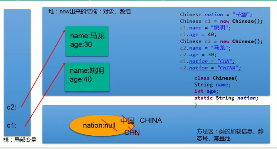
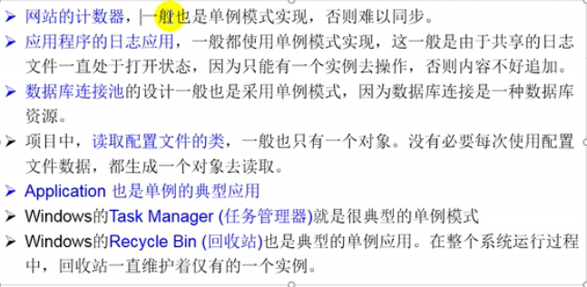

# 面向对象（下）


## 1. 关键字： static

1. **关键字的使用**

   - static： 静态的

   - static: 可以用来修饰： 属性、方法、代码块、内部类

   - 使用static修饰的属性： 静态变量(类变量)

     - 按是否使用static修饰，又分为静态属性 vs 非静态属性（实例变量）

     - 实例变量，我们创建了类的多个对象，每个对象都独立的拥有一套类中的非静态属性。当修改其中一个对象中的非静态属性时，不会导致其他对象中的同样的属性值修改

     - 静态变量： 我们创建了类的多个对象，多个对象共享同一个静态变量。当通过某一个对象修改静态变量时，会导致其他对象调用此静态变量时，是修改过了的。

     - 其他说明

       - 静态变量随着随着类的加载而加载，可以通过 “类.静态变量” 的方式调用

       - 静态变量的加载要早于对象的创建

       - 由于类只加载一次，则静态变量在内存中也会只存在一份，存在方法区的静态域中

       - |      | 类变量 | 实例变量 |
         | ---- | :----- | -------- |
         | 类   | yes    | no       |
         | 对象 | yes    | yes      |

   - 静态属性举例：System.out; Math.PI;

2. **类变量vs实例变量的内存解析**

   

3. **使用static修饰方法： 静态方法**

   - 随着类的加载而加载，可以通过 “类.静态方法” 的方式进行调用

   - |      | 静态方法 | 非静态方法 |
     | ---- | :------- | ---------- |
     | 类   | yes      | no         |
     | 对象 | yes      | yes        |

   - 静态方法中，只能调用只能调用静态的方法或属性

   - 非静态方法中，既可以调用非静态方法或属性，又可以调用静态的方法或属性

4. **static 注意点**

   - 在静态的方法内，不能使用this关键字、super关键字
   - 关于静态属性和静态方法的使用，都从生命周期的角度去考虑

5. **总结：**

   1. - 静态方法只能访问静态成员（包括成员变量和成员方法）--------不能访问本类中的非静态方法，但是可以访问其他类的非静态成员方法，通过创建对象的形式，调用其它类中的非静态成员方法

      - 也可以在本类中间接调用非静态方法(通过调用自身构造方法,然后用对象调用本类非静态方法)

   2. 

   - 在开发中，如何确定一个属性是否要声明为static

     > 属性是可以被多个对象所共享的，不会随着对象的不同而不同的。

     > 类中常量也常常声明为static

   - 在开发中，如何确定一个方法是否要声明为static

     > 操作静态属性的方法，通常设置为static的

     > 工具类中的方法，习惯性声明为static。比如： Math\Arrays\Collections


### 1.1 单例设计模式（Singleton）

> 设计模式是在大量的实践中总结和理论化之后优选的代码结构、编程风格、以及解决问题的思考方式。
>
> 设计模式，就像是经典的棋谱，不同的棋局，我们用不同的棋谱，免去我们自己再思考和摸索。


- 所谓单例设计模式，就是采取一定的方法保证在整个软件系统中，对某个类只能存在一个对象实例

1. **如何实现**

   ```java
   //懒汉式
   class Orders{
       //私有化类的构造器
       private Orders(){
   
       }
       //先声明当前类对象，没有初始化
       //此对象也必须为static
       private static Orders instance = null;
   
       //声明public、static的返回当前对象方法
       public  static Orders getInstance(){
           if(instance == null){
               instance = new Orders();
           }
           return instance;
       }
   }
   ```

   ```java
   //饿汉式
   class Bank{
       //1.私有化类的构造器
       private Bank(){
   
       }
       //内部创建类的对象
       //要求此对象必须声明为静态的
       private static Bank instance = new Bank();
       //提供公共的静态方法，返回类的对象
       public static Bank getInstance(){
           return instance;
       }
   }
   ```

   

2. **如何区分懒汉式和饿汉式？**

   - 饿汉式：
     - 坏处： 对象加载时间过长
     - 好处： 饿汉式是线程安全的
   - 懒汉式：
     - 好处：延迟对象的创建

3. **单例模式优点：**

   - 由于单例模式只生成一个实例，减少了系统的开销

4. **应用场景：**

   


## 2. 理解main方法的语法

1. **main()方法的使用说明**
   - main方法作为程序的入口
   - main方法也是一个普通的静态方法
   - main()方法可以作为我们与控制台交互的方式。（如 Scanner）


## 3. 类的成员之四： 代码块

代码块（初始化块）

1. **代码块的作用：** 用来初始化类、对象

2. **分类：** 静态代码块 vs 非静态代码块

3. **静态代码块**

   >内部可以有输出语句
   >
   >随着类的加载而执行，而且只执行一次
   >
   >**作用：** 初始化类的信息
   >
   >如果一个类中定义了多个静态代码块，则按声明的先后顺序执行
   >
   >静态代码块的执行顺序要优先于非静态代码块的执行
   >
   >静态代码块内只能调用静态的属性、静态的方法，不能调用非静态的结构

4. **非静态代码块**

   >内部可以有输出语句
   >
   >随着对象的创建而调用
   >
   >每创建一个对象就执行一次
   >
   >**作用：**可以在创建对象时，对对象的属性等进行初始化
   >
   >如果一个类中定义了多个非静态代码块，则按声明的先后顺序执行
   >
   >非静态代码块内可以调用静态的属性、方法，或非静态的属性、方法

5. **对属性可以赋值的位置**

   ①默认初始化

   ②显式初始化

   ③构造器中初始化

   ④有了对象以后，可以通过 “对象.属性” 或 ”对象.方法“ 的方式进行赋值

   ⑤在代码块中赋值

   - 顺序：1 -> 2 / 5 -> 3 -> 4

   

## 4. 关键字： final

1. final（最终的）可以用来修饰的结构 :  类、方法、变量

2. **final 用来修饰一个类：** 此类不能被其他的类所继承

   - 比如：String类、System类、StringBuffer类

3. **final 用来修饰方法：** 表明此方法不能被重写

   - 比如：Object 类中getClass();

4. **final 用来修饰变量**： 此时的 “变量” 就称为是一个常量

   - final 修饰属性： 可以考虑赋值的位置有：
     - 显式初始化
     - 代码块中初始化
     - 构造器中初始化
   - final 修饰局部变量： 
     - 尤其是使用final修饰形参时，表明此形参是一个常量。当我们调用此方法时，给常量形参赋一个实参，一旦赋值以后，就只能在方法体内使用此形参，但不能进行重新赋值

5. **static final ： **

   - 用来修饰一个属性： 全局常量
   - 用来修饰一个方法： 可以用类调，不可重写

   

## 5.  抽象类与抽象方法

1. **abstract 关键字的使用**

   - abstract ： 抽象的

   - abstract 可以用来修饰的结构： 类、方法

   - abstract 修饰类： 抽象类

     > 此类不能实例化
     >
     > 抽象类中一定有构造器，便于子类实例化时使用。（涉及： 子类对象实例化的全过程）
     >
     > 开发中，都会提供抽象类的子类，让子类对象实例化，完成相关的操作

   - abstract 修饰方法： 抽象方法

     > - 抽象方法只有方法的声明，没有方法体
     >
     > - 包含抽象方法的类，一定是一个抽象类。反之，抽象类中可以没有抽象发放发
     >
     > - 若子类重写了父类中所有的抽象发方法后，此子类方可实例化
     >
     >   若子类没有重写了父类中所有的抽象发方法，则此子类也是一个抽象类

2. **Abstract使用上的注意点：**

   - abstract不能用来修饰： 属性、构造器等等结构
   - abstract不能用来修饰:  私有方法，静态方法、final的方法、final的类

3. **抽象类的匿名子类：**

   ```java
   public class PersonTest{
       public static void main(String[] args){
           method(new Student()) //匿名对象
           Worker worker = new Worker();
           method1(worker); //非匿名的对象非匿名的类
           method1(new worker()); //匿名的对象非匿名的类
           //创建了一个匿名子类的对象：p
           Person p = new Person(){
               public void eat(){
                   
               }
               public void breath(){
                   
               }
           }
           method1(p);
           //创建匿名子类的匿名对象
           method1(new Person(){
               public void eat(){
                   
               }
               public void breath(){
                   
               }
           });
       }
       public static void method(Student s){
           
       }
       public static void method1(Person p){
           p.eat();
           p.walk();
       }
   }
   class Worker extends Person{
       public void eat(){
           
       }
       public void breath(){
           
       }
   }
   ```


### 多态的应用： 模板方法设计模式（TemplateMethod）

> 抽象类体现的就是一种模板模式的设计，抽象类作为多个子类的通用模板，子类在抽象类的基础上进行扩展、改造、但子类总体上会保留抽象类的行为方式

1. 解决的问题：

   - 当功能内部一部分实现是确定的，一部分实现是不确定的。这时可以把不确定的部分暴露出去，让子类去实现

2. ```java
   //抽象类的应用： 模板方法的设计模式
   public class TemplateTest {
       public static void main(String[] args){
           Template t = new SubTemplate();
           t.spendTime();
       }
   }
   
   abstract class Template{
       //计算某段代码执行所需要花费的时间
       public void spendTime(){
           long start = System.currentTimeMillis();
           code(); //不确定的部分，易变的部分
           long end = System.currentTimeMillis();
           System.out.println("花费的时间为："+(end - start));
       }
       public abstract void code();
   }
   class SubTemplate extends Template{
       public void code(){
           for(int i = 2; i <= 1000; i++){
               boolean isFlag = true;
               for(int j = 2; j <= Math.sqrt(i); j++){
                   if(i % j == 0){
                       isFlag = false;
                       break;
                   }
               }
               if(isFlag) System.out.println(i);
           }
       }
   }
   ```


## 6. 接口（interface）


## 7. 类的成员之五： 内部类


