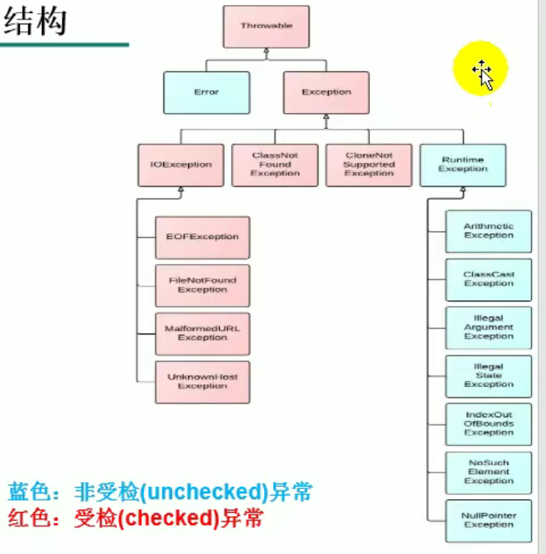
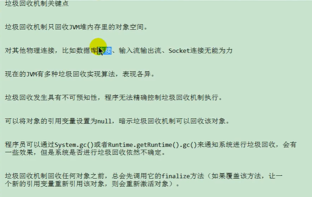
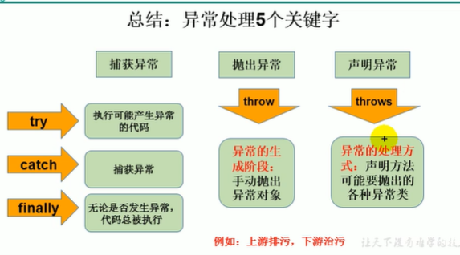
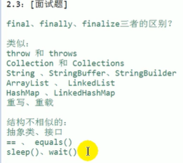

# 异常处理


## 1. 异常概述与异常体系结构

1、异常： 在Java语言中，将程序执行中发生的不正常情况称为“异常”

2、Java程序在执行过程中所发生的异常事件可分两类：

- Error：Java虚拟机无法解决的严重问题
  - 如：JVM系统内部错误、资源耗尽等严重情况
  - 比如：StackOverflowError 和 OOM
- Exception：其它因编程错误或偶然的外在因素导致的一般性问题，可以使用针对性的代码进行处理
  - 如：空指针访问、试图读取不存在的文件、网络链接中断、数组角标越界




3、异常体系结构

- java.lang.Throwable

  ​            |------ java.lang.Error : 一般不编写针对性的代码进行处理

  ​            |------ java.lang.Exception : 可以进行异常的处理

  ​                                    |--------- 编译型异常(checked)

  ​                                                                |--------- ClassNotFoundException

  ​                                                                |---------- FileNotFoundException

  ​                                    |--------- 运行时异常（unchecked）

  ​                                                                  |-------- NullPointerException

  ​                                                                  |-------- ArrayIndexOutOfBoundException

  ​                                                                  |-------- ClassCastException

  ​                                                                  |-------- NumberFormatException


## 2. 常见异常

```java
public class ExceptionTest {
    //NullPointerException
    @Test
    public void test1(){
        int arr[] = null;
        System.out.println(arr[3]);
    }
    //java.lang.ClassCastException
    @Test
    public void test2(){
        Object obj = new Date();
        String str = (String) obj;
    }
    //ArrayIndexOutOfBoundsException
    @Test
    public void test3(){
        int arr[] = new int[3];
        System.out.println(arr[4]);
    }
    //NumberFormatException
    @Test
    public void test4(){
        String str = "abc";
        int num = Integer.parseInt(str);
    }
    //InputMismatchException
    @Test
    public void test5(){
        Scanner scanner = new Scanner(System.in);
        int score = scanner.nextInt();
        System.out.println(score);
    }
    //ArithmeticException
    @Test
    public void test6(){
        int a = 10;
        int b = 0;
        System.out.println(a / b);
    }
}
```


## 3. 异常处理机制一：try-catch-finally

异常的处理：抓抛模型


过程1 ： “抛” ： 程序在正常执行过程中，一旦出现异常，就会在异常代码处，生成一个对应异常类的对象，并将此对象抛出。一旦抛出异常后，其后的代码就不在执行


过程2：“抓”： 可以理解为异常处理方式

- try-catch-finally
- throws


1. ```java
    try{
        //可能出现异常的代码
    }catch(异常类型1 变量1){
        //处理异常的方式
    }catch(异常类型2 变量2){
        //处理异常的方式
    }catch(异常类型3 变量3){
        //处理异常的方式
    }
   finally{
       //一定会执行的代码
   }
   ```

- finally是可选的
- 使用try将可能出现的异常代码包装起来，在执行过程中，一旦出现异常，就会生成一个对应异常类的对象，根据此对象的类型，去catch中进行匹配
- 一旦try中的异常对象匹配到某一个catch时，就进入catch中进行异常处理。一旦处理完成，就跳出当前的try-catch结构，在没有写finally的情况下。继续执行其后的代码
- catch中的异常类型如果没有子父类关系，则声明在上，谁声明在下无所谓
- catch中的异常类型如果满足子父类关系，则要求子类一定声明在上。否则，报错
- 常用的异常对象的处理方式：
  - getMessage()
  - printStackTrace()
- 在try结构中声明的变量，在出了try结构后就不能在被调用
- 体会：使用try-catch-finally处理编译时异常，时得程序在编译时就不再报错，但是运行时仍可能报错，相当于我们使用try-catch-finally 将一个编译时可能出现得错误，延迟到运行时出现了
  - 开发中，由于运行时异常比较常见，所以我们通常就不针对运行时异常编写try-catch-finally了。针对于编译时异常，我们说一定要考虑异常处理
  - 


finally的使用：

1. finally是可选的
2. finally中声明的是一定会被执行的代码，即使catch中又出现异常了，try中有return语句，catch中有return语句等情况。


什么时候语句写在finally中？



1. 像数据库连接、输入输出流、网络编程Socket等资源，JVM是不能自动回收的，我们需要手动的进行资源释放，就需要声明在finally中


## 4. 异常处理机制二: throws

- throws + 异常类型

1. "throws + 异常类型"写在方法的声明处，指明此方法执行时，可能会抛出异常类型

2. 一旦当方法体执行时，出现异常，仍会在异常代码处生成一个异常类对象，此对象满足throws后异常类型时，就会被抛出。

3. 异常代码后续代码就不在执行

4. 体会：try-catch-finally： 真正的将异常处理掉了。

   ​            throws方式只是将异常抛给了方法的调用者，并没有将异常处理掉


#### 重写方法异常抛出的规则

1. 子类重写的方法抛出的异常类型不大于父类被重写的方法抛出的异常


#### 开发中如何选择try-catch-finally 还是 throws

1. 如果父类中被重写的方法没有throws方式处理异常，则子类重写的方法也不能使用throws，意味着如果子类重写的方法中有异常，必须使用try-catch-finally
2. 执行的方法a中，先后又调用了另外的几个方法，这几个方法是递进关系执行的。我们建议这几个方法使用throws的方式进行处理，而执行的方法a可以考虑使用try-catch-finally方式进行处理


## 5. 手动抛出异常

关于异常对象的产生

- 系统自动生成的异常对象
- 手动的生成一个异常对象，并抛出（throws）


## 6. 用户自定义异常类

如何自定义异常类

1. 继承于现有的异常结构：RuntimeException.Exception
2. 提供全局常量：serialVersionUID
3. 提供重载的构造器


## 7.总结




