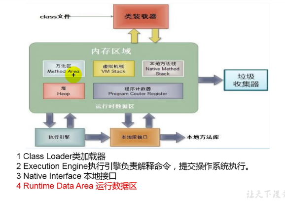
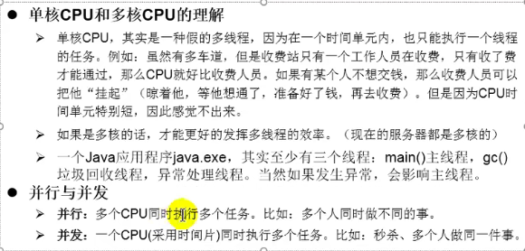
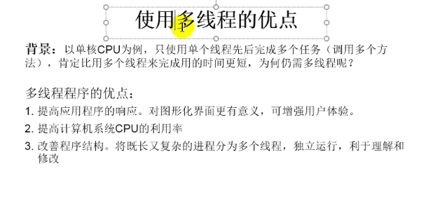

# 多线程

## 1. 基本概念

程序：是为完成特定任务、用某种语言编写的一组指令的集合

进程：是程序的一次执行过程

线程：是程序内部的一条执行路径

## 2. 线程的创建和使用

1. 

2. 

### 2.1  Thread 类中特有的方法

> 1. start():启动当前线程，执行当前线程的run()
>
> 2. run():通常需要重写Thread类中的此方法，将创建的线程要执行的操作声明在此方法中
>
> 3. currentThread(): 静态方法，返回当前代码执行的线程
>
> 4. getName():获取当前线程的名字
>
> 5. setName():设置当前线程的名字
>
> 6. yield():释放当前CPU的执行权
>
> 7. join():在线程a中调用线程b的join(),此时线程a就进入阻塞状态，直到线程b完全执行完以后，线程a才结束阻塞状态。
>
> 8. stop():已过时。当执行此方法时，强制结束当前线程。
>
> 9. sleep(long millitime)：让当前线程“睡眠”指定时间的millitime毫秒)。在指定的millitime毫秒时间内，
>
>  * 当前线程是阻塞状态的。
>
> 10. isAlive()：返回boolean，判断线程是否还活着

### 2.2 线程的调度

1. 调度策略
   - 时间片
   - 抢占式：高优先级的线程抢占CPU
2. Java的调度方法
   - 同优先级线程组成先进先出队列,使用时间片策略
   - 对高优先级，使用优先调度的抢占式策略

### 2.3 继承方式和实现方式的联系与区别

开发中：优先选择：实现Runnable接口的方式

原因：1. 实现的方式没有类的单继承性的局限性

​            2. 实现的方式更适合来处理多个线程有共享数据的情况。

联系：public class Thread implements Runnable

相同点：两种方式都需要重写run(),将线程要执行的逻辑声明在run()中。

## 3. 线程的生命周期

## 4. 线程的同步

### 4.1 死锁

1. 理解： 不同的线程分别占用对方需要的同步资源不放弃，都在等待对方放弃自己需要的同步资源，就形成了线程的死锁

2. 说明: 

   出现死锁后，不会出现异常，不会出现提示，只是所有的线程都处于阻塞状态，无法继续 

   我们使用同步时，要避免出现死锁

## 5. 线程的通信

1. *涉及到的三个方法：*
   - wait():一旦执行此方法，当前线程就进入阻塞状态，并释放同步监视器。
   - notify():一旦执行此方法，就会唤醒被wait的一个线程。如果有多个线程被wait，就唤醒优先级高的那
   - notifyAll():一旦执行此方法，就会唤醒所有被wait的线程。
2. 说明
   - 说明：
      *      wait()，notify()，notifyAll()三个方法必须使用在同步代码块或同步方法中。
      *      wait()，notify()，notifyAll()三个方法的调用者必须是同步代码块或同步方法中的同步监视器。否则，会出现IllegalMonitorStateException异常
      *      wait()，notify()，notifyAll()三个方法是定义在java.lang.Object类中。
3.  面试题：sleep() 和 wait()的异同？
    * 相同点：一旦执行方法，都可以使得当前的线程进入阻塞状态。
    * 不同点：
      - 1）两个方法声明的位置不同：Thread类中声明sleep() , Object类中声明wait()
      - 2）调用的要求不同：sleep()可以在任何需要的场景下调用。 wait()必须使用在同步代码块或同步方
      - 3）关于是否释放同步监视器：如果两个方法都使用在同步代码块或同步方法中，sleep()不会释放锁，wait()会释放锁。

## 6. JDK5.0 新增线程创建方式

1. 创建多线程的方式三：实现Callable接口
   - 可以对具体Runnable、Callable任务的执行结果进行取消、查询是否完成、获取结果等。
   - FutrueTask是Futrue接口的唯一的实现类
   - FutureTask同时实现了Runnable, Future接口。它既可以作为Runnable被线程执行，又可以作为Future得到Callable的返回值
2. 线程池
   - 背景：经常创建和销毁、使用特别大的资源，比如并发情况下，对性能影响很大
   - 思路：提前创建好多个线程，放入线程池中，使用时直接获取，使用完放回池中。可以避免频繁创建销毁、实现重复利用。类似生活中的公共交通工具。
   - 好处：
     - 提高响应速度（减少了创建新线程的时间）
     - 降低资源消耗（重复利用线程池中线程，不需要每次都创建）
     - 便于线程管理
   - 相关API
     - JDK 5.0起提供了线程池相关API：ExecutorService和Executors
     - ExecutorService：真正的线程池接口。常见子类ThreadPoolExecutor
       - void execute(Runnable command) ：执行任务/命令，没有返回值，一般用来执行Runnable
       - Future submit(Callable task)：执行任务，有返回值，一般又来执行Callable
       - void shutdown()：关闭连接池
     - Executors：工具类、线程池的工厂类，用于创建并返回不同类型的线程池Executors.newCachedThreadPool()：创建一个可根据需要创建新线程的线程池
       Executors.newFixedThreadPool(n); 创建一个可重用固定线程数的线程池
       Executors.newSingleThreadExecutor()：创建一个只有一个线程的线程池
       Executors.newScheduledThreadPool(n)：创建一个线程池，它可安排在给定延迟后运行命令或者定期地执行。
