# Java常用类


## 1. 字符串相关的类


### 1.1 String类

#### 1.1 - 1 String 的特性


1. String 是一个<font color='orange'>final 类</font>，代表不可变的字符序列

    

2. 字符串是<font color='green'>常量</font>，用双引号引起来表示。他们的值在创建之后不能更改

    

3. String对象的字符内容是存储在一个字符数组value[]中的

    

4. String字符串，使用一对“”引起来表示

    

5. String 声明为final 的，<font color='green'>不可被继承</font>

    

6. String 实现了Serializable接口：表示字符串是支持序列化的

​                   实现了Comparable接口：表示String可以比较大小


7. String 内部定义了final char[] value 用于存储字符串数据

    

8. 体现： 
   - 当对字符串重新赋值时，需要重写指定内存区域赋值，不能使用原有的value进行赋值内存区域赋值
   
   - 当对现有的字符串进行连接操作时，也需要重新指定内存区域赋值，不能使用原有的value进行赋值内存区域赋值

   - 当调用String 的 replace()方法修改指定的字符或字符串时，不能使用原有的value进行赋值内存区域赋值
   
       
   
9. 通过<font color='LightSeaGreen'>字面量的方式</font>（区别于new）给一个字符串赋值，此时的字符串值声明在<font color='LightSeaGreen'>字符串常量池</font>中

    

10. 字符串常量池中是<font color='purple'>不会存储相同内容的字符串</font>的

    

11. ***String对象的创建***

    - 

    - 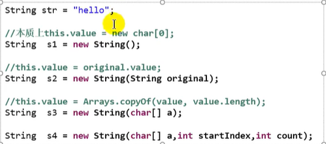

    - 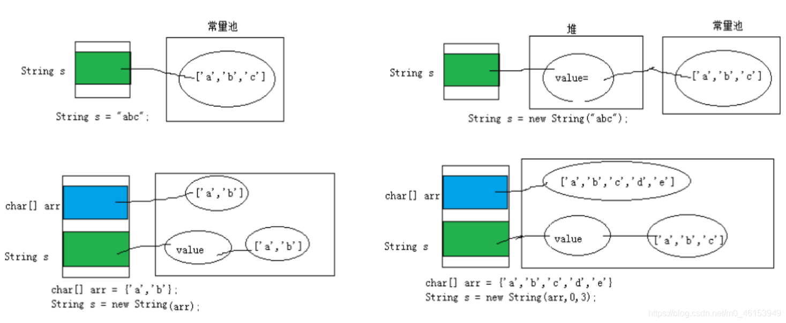

    - 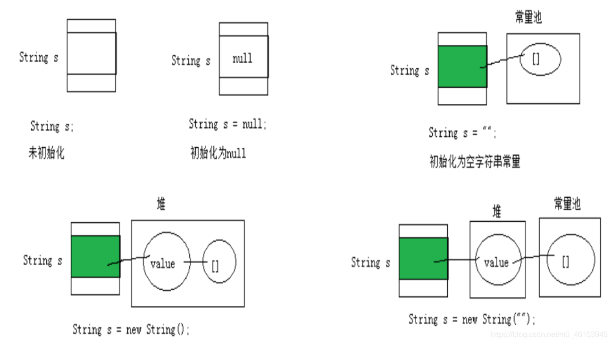

        

12. <font color='LightSeaGreen'>**String 的实例化**</font>

    - 方式一：通过字面量定义的方式：声明在方法区的字符串常量池中

    - 方式二：通过new + 构造器的方式 ： 是数据在<font color='DarkGoldenrod'>堆空间中开辟空间以后对应的地址值</font>

        

13. *面试题*： String s = new String("abc");方式创建对象，在内存中创建了几个对象

    - 两个： 一个是堆空间中new结构，另一个是char[]对应的常量池中的数据：“abc”

        

14. ***字符串拼接：***

    

    
    
    - 结论
      - 常量与常量的拼接结果在常量池。且常量池中不会存在相同内容的常量
      - <font color='green'>只要其中有一个是变量，结果就在堆中</font>
      - 如果拼接的结果调用intern()方法，返回值在常量池中


#### 1.1 - 2  String 的常用方法

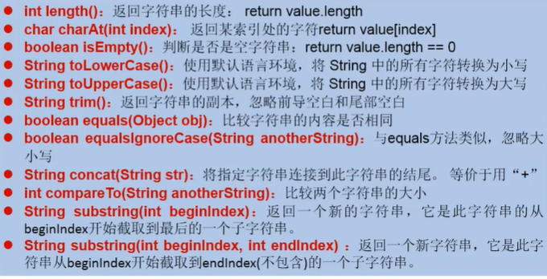

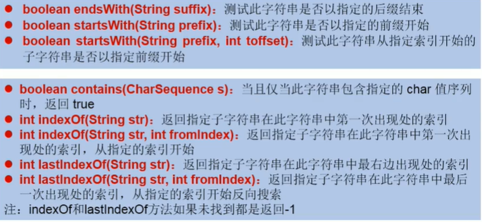

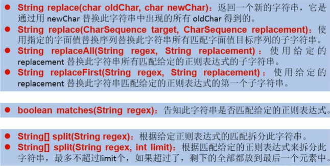


#### 1.1 - 3 String 与 char[] 之间的转换

1. `str.toCharArray()`
2. String str = new String(arr)


#### 1.1 - 4  String 与 byte[] 之间的转换

1. `str.getBytes()`

2. 构造器

3. 解码时，要求解码使用的字符集必须与编码时使用的字符集一致

   

### 1.2 StringBuffer类

> java.lang.StringBuffer 代表可变的字符序列
>
> 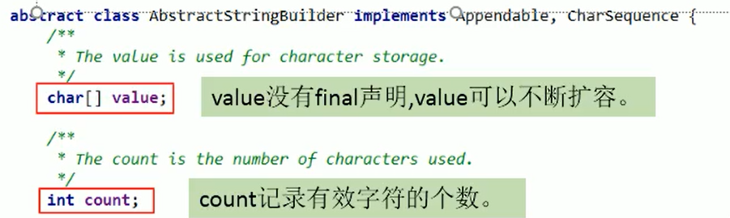


**String,StringBuffer,StringBuilder 三者的异同**

- <font color='DarkGoldenrod'>String</font> : 不可变的字符序列，底层使用 char[]
- <font color='DarkGoldenrod'>StringBuffer</font> ：可变的字符序列，线程安全的，效率低,底层使用char[]
- <font color='DarkGoldenrod'>StringBuilder</font>：可变的字符序列,线程不安全的，jdk 5.0新增,底层使用char[]


**常用方法**

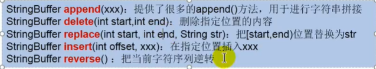

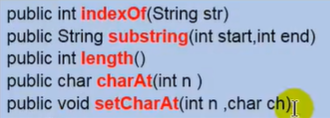


### 1.3 JVM

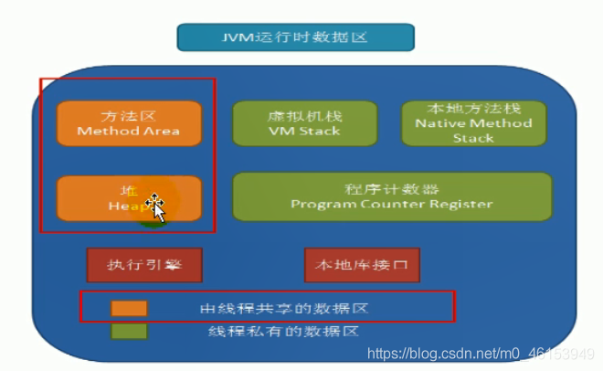

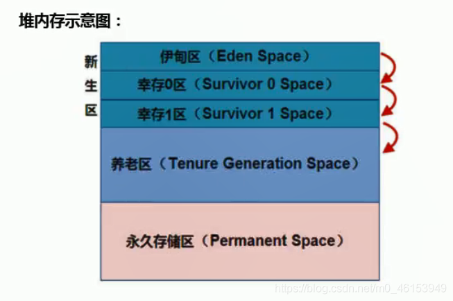

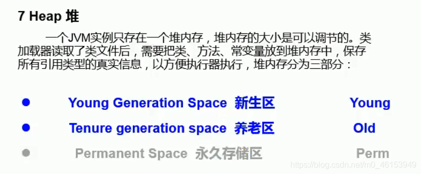

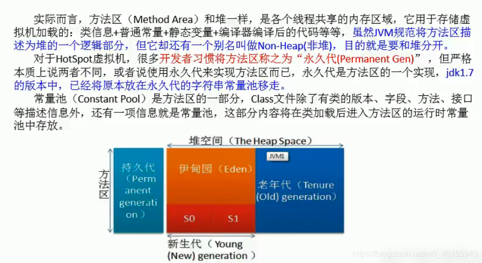

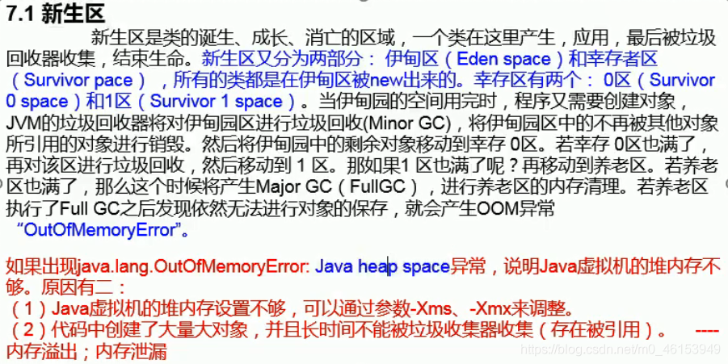

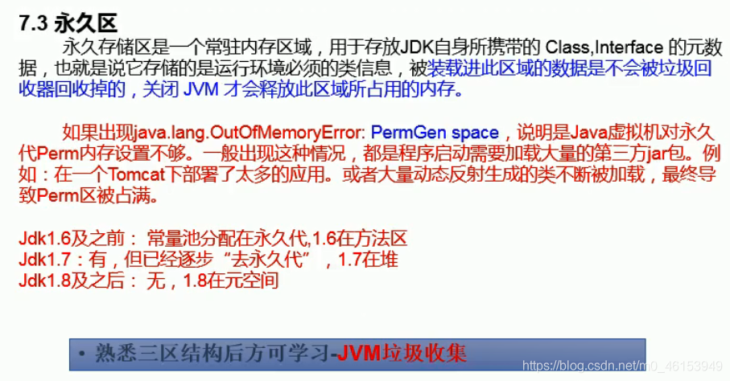

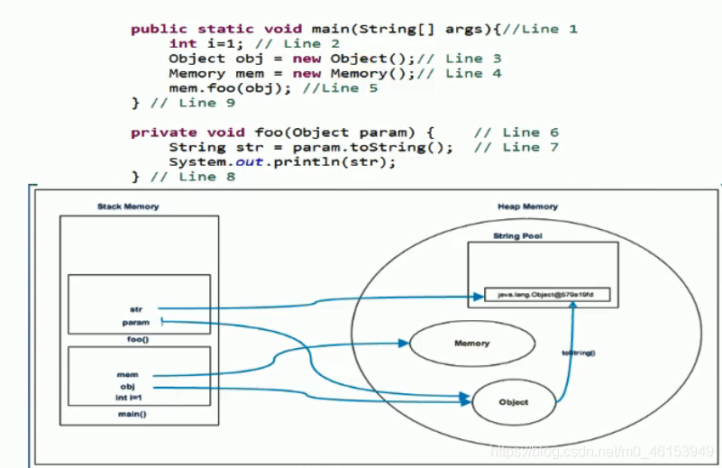

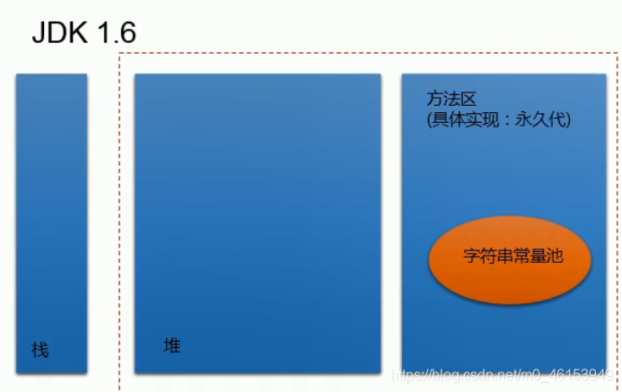

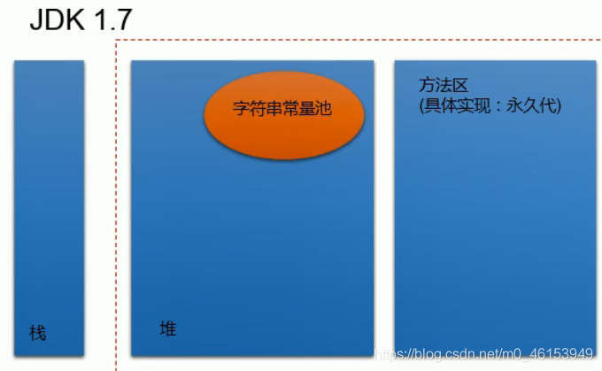

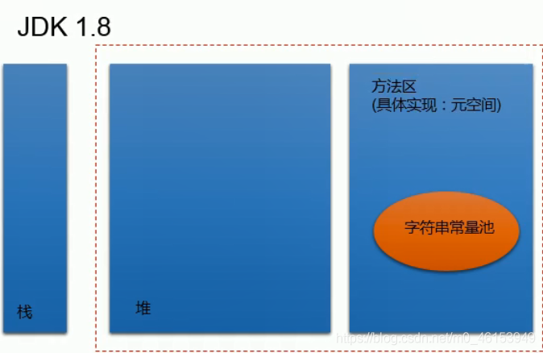


## 2. JDK 8 之前的日期时间API


### 2.1 System类中获取时间戳的方法

> java.lang.System类中的<font color='orange'>currentTimeMillis() : </font>

- 返回当前时间与1970年1月1日0时0分0秒之间以毫秒为单位的时间差，称为<font color='orange'>时间戳</font>
- 此方法适于*计算时间差。*
- 计算世界时间的主要标准有：
    - UTC(Coordinated Universal Time)
    - GMT(Greenwich Mean Time)东八区区时
    - CST(Central Standard Time)


### 2.2 Java中两个Date类的使用

#### 2.2 - 1 java.util.Date类

> 表示特定的瞬间精确到*毫秒*

- **构造器**
  - Date() : 使用无参构造器创建的对象可以获取<font color='green'>本地当前的时间</font>
  - Date(long date)：*创建指定毫秒数的Date对象*

- **常用方法**
  - getTime() : 返回自1970年1月1日0时0分0秒GMT 以来此Date对象表示的毫秒数
  - toString() : 把此Date对象转换为一下形式的String：dow mon dd hh : mm : ss :zzz : yyyy


### 2.3 java.sql.Date 

> *java.sql.Date对应着数据库中的日期类型的变量*

- 实例化：

    ```java
    java.sql.Date date3 = new java.sql.Date(35235325345L);
    System.out.println(date3);  //1971-02-13
    ```

- *如何将java.util.Date对象转换为java.sql.Date对象*

    ```java
    //情况一：
            Date date4 = new java.sql.Date(2343243242323L);
            java.sql.Date date5 = (java.sql.Date) date4;
    //情况二：
            Date date6 = new Date();
            java.sql.Date date7 = new java.sql.Date(date6.getTime());
    ```

    


### 2.4 java.text.SimpleDateFormat(API)

> - `Date`类的API不易于国际化，大部分被废弃了，`java.text.SimpleDateFormat`类是一个不与语言环境有关的方式来格式化和解析日期的具体类。
> - 它允许进行
>     - 格式化：日期—>文本
>     - 解析：文本—>日期

```java
import org.junit.Test;

import java.text.ParseException;
import java.text.SimpleDateFormat;
import java.util.Date;

public class DateTime {
    @Test
    public void testSimpleDateFormat() throws ParseException {
        //实例化SimpleDateFormat
        SimpleDateFormat sdf = new SimpleDateFormat();

        //格式化：日期---》字符串
        Date date = new Date();
        System.out.println(date);   //Sun May 10 16:34:30 CST 2020

        String format = sdf.format(date);
        System.out.println(format); //20-5-10 下午4:34

        //解析：格式化的逆过程，字符串---》日期
        String str = "19-12-18 上午11:43";
        Date date1 = sdf.parse(str);
        System.out.println(date1);  //Wed Dec 18 11:43:00 CST 2019

        //*************按照指定的方式格式化和解析：调用带参的构造器*****************
//        SimpleDateFormat sdf1 = new SimpleDateFormat("yyyyy.MMMMM.dd GGG hh:mm aaa");
        SimpleDateFormat sdf1 = new SimpleDateFormat("yyyyy.MMMMM.dd GGG hh:mm aaa");
        //格式化
        String format1 = sdf1.format(date);
        System.out.println(format1);    //02020.五月.10 公元 04:32 下午
        //解析:要求字符串必须是符合SimpleDateFormat识别的格式(通过构造器参数体现),
        //否则，抛异常
        Date date2 = sdf1.parse("02020.五月.10 公元 04:32 下午");
        System.out.println(date2);  //Sun May 10 16:32:00 CST 2020
    }
}

```


### 2.5 java.util.Calender

> `Calendar`是一个抽象基类，主用用于<font color='purple'>完成日期字段之间相互操作</font>的功能

- <font color='cornflowerblue'>获取Calendar实例的方法</font>

    - 使用Calendar.getInstance()方法
    - 调用它的子类GregorianCalendar的构造器。

    

- 一个Calendar的实例是系统时间的抽象表示，通过get(intfield)方法来取得想要的时间信息。比如<font color='green'>YEAR、MONTH、DAY_OF_WEEK、HOUR_OF_DAY 、MINUTE、SECOND</font>

- public void set(intfield,intvalue)

    - public void add(intfield,intamount)
    - public final Date getTime()
    - public final void setTime(Date date)

    

- 注意:

    - 获取月份时：一月是0，二月是1，以此类推，12月是11
    - 获取星期时：周日是1，周二是2，。。。。周六是7

```java
import java.util.Calendar;
import java.util.Date;

import org.junit.Test;

public class DateTime {
    @Test
    public void testCalendar(){
        //1.实例化
        //方式一：创建其子类（GregorianCalendar）的对象
        //方式二：调用其静态方法getInstance()
        Calendar calendar = Calendar.getInstance();
//System.out.println(calendar.getClass()); ==> class java.util.GregorianCalendar


        //2.常用方法
        //get()
        int days = calendar.get(Calendar.DAY_OF_MONTH);
        System.out.println(days);   //10
        System.out.println(calendar.get(Calendar.DAY_OF_YEAR)); //131,今天是这一年的131天

        //set()
        //calendar可变性
        calendar.set(Calendar.DAY_OF_MONTH,22);
        days = calendar.get(Calendar.DAY_OF_MONTH);
        System.out.println(days);   //22

        //add()
        calendar.add(Calendar.DAY_OF_MONTH,-3);
        days = calendar.get(Calendar.DAY_OF_MONTH);
        System.out.println(days);   //22-3 --》19

        //getTime():日历类---> Date
        Date date = calendar.getTime();
        System.out.println(date);   //Tue May 19 17:12:06 CST 2020

        //setTime():Date ---> 日历类
        Date date1 = new Date();
        calendar.setTime(date1);
        days = calendar.get(Calendar.DAY_OF_MONTH);
        System.out.println(days);   //10
    }
}

```


## 3. JDK 8 中新日期时间API

> - 可变性：像日期和时间这样的类应该是不可变的。
> - 偏移性：Date中的年份是从1900开始的，而月份都从0开始。
> - 格式化：格式化只对Date有用，Calendar则不行。
> - 此外，它们也不是线程安全的；不能处理闰秒等。

> `java.time` 中包含了所有关于**本地日期（LocalDate）、本地时间（LocalTime）、本地日期时间（LocalDateTime）、时区（ZonedDateTime）和持续时间（Duration）的类**


- <font color='DarkGoldenrod'>java.time–</font>包含值对象的基础包

- <font color='DarkGoldenrod'>java.time.chrono–</font>提供对不同的日历系统的访问

- <font color='DarkGoldenrod'>java.time.format–</font>格式化和解析时间和日期

- <font color='DarkGoldenrod'>java.time.temporal–</font>包括底层框架和扩展特性

- <font color='DarkGoldenrod'>java.time.zone–</font>包含时区支持的类


### 3.1 LocalDate、LocalTime、LocalDateTime

> 它们的实例是**不可变的对象**，分别表示使用ISO-8601日历系统的日期、时间、日期和时间。它们提供了简单的本地日期或时间，并不包含当前的时间信息，也不包含与时区相关的信息。

- <font color='cornflowerblue'>LocalDate:</font> 代表IOS格式（yyyy-MM-dd）的日期,可以存储生日、纪念日等日期。
- <font color='cornflowerblue'>LocalTime:</font> 表示一个时间，而不是日期。
- <font color='cornflowerblue'>LocalDateTime:</font> 是用来表示日期和时间的，**这是一个最常用的类之一**。

注：ISO-8601日历系统是国际标准化组织制定的现代公民的日期和时间的表示法，也就是公历。


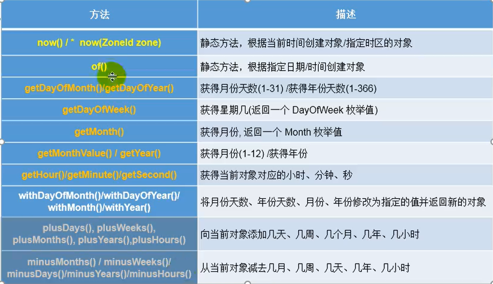


### 3.2 Instant类

> 时间线上的一个瞬时点。这可能被用来记录应用程序中的事件时间戳。
>
> java.time包通过值类型Instant提供机器视图，不提供处理人类意义上的时间单位。Instant表示时间线上的一点，而不需要任何上下文信息，例如，时区。概念上讲，它只是简单的表示自1970年1月1日0时0分0秒（UTC）开始的秒数。因为java.time包是基于纳秒计算的，所以Instant的精度可以达到纳秒级。

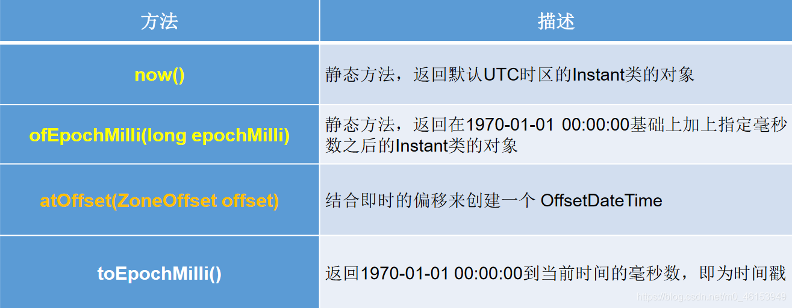

> 时间戳是指格林威治时间1970年01月01日00时00分00秒(北京时间1970年01月01日08时00分00秒)起至现在的总秒数。

```java
import org.junit.Test;

import java.time.*;
public class JDK8DateTimeTest {
    @Test
    public void test2(){
//now():获取本初子午线对应的标准时间
        Instant instant = Instant.now();
        System.out.println(instant);   
        
//添加时间的偏移量
        OffsetDateTime offsetDateTime = instant.atOffset(ZoneOffset.ofHours(8));//东八区
        System.out.println(offsetDateTime); 

//toEpochMilli():获取自1970年1月1日0时0分0秒（UTC）开始的毫秒数  ---> Date类的getTime()
        long milli = instant.toEpochMilli();
        System.out.println(milli);  //1589104867591

//ofEpochMilli():通过给定的毫秒数，获取Instant实例  -->Date(long millis)
        Instant instant1 = Instant.ofEpochMilli(1550475314878L);
        System.out.println(instant1);   //2019-02-18T07:35:14.878Z
    }
}

```


### 3.3  DateTimeFormatter

> *DateTimeFormatter:格式化或解析日期、时间*
>
>  *类似于SimpleDateFormat*

- <font color='green'>预定义的标准格式</font>。如：ISO_LOCAL_DATE_TIME; ISO_LOCAL_DATE; ISO_LOCAL_TIME
- <font color='green'>本地化相关的格式</font>。如：ofLocalizedDateTime(FormatStyle.LONG)
- <font color='green'>自定义的格式</font>。如：ofPattern(“yyyy-MM-dd hh:mm:ss”)

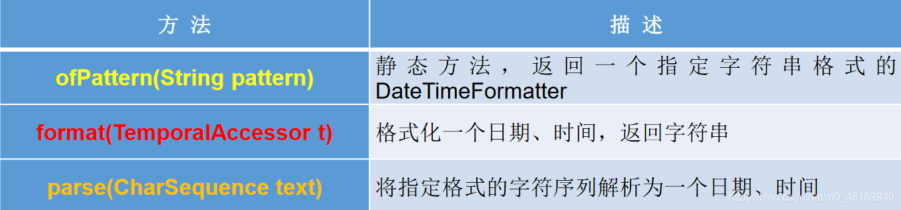


### 3.4 其它日期时间相关API的使用

- <font color='orange'>ZoneId</font>：该类中包含了所有的时区信息，一个时区的ID，如Europe/Paris

    - *ZoneId的getAvailableZoneIds():获取所有的ZoneId*
    - *ZoneId的of():获取指定时区的时间*

    

- <font color='orange'>ZonedDateTime</font>：一个在ISO-8601日历系统时区的日期时间，如2007-12-03T10:15:30+01:00Europe/Paris。

    - 其中每个时区都对应着ID，地区ID都为“{区域}/{城市}”的格式，例如：Asia/Shanghai等
    - *<font color='green'>ZonedDateTime的now()</font>: 获取本时区的ZonedDateTime对象*
    - *<font color='green'>ZonedDateTime的now(ZoneId id):</font> 获取指定时区的ZonedDateTime对象*


- <font color='orange'>Clock：</font>使用时区提供对当前即时、日期和时间的访问的时钟。


- 持续时间：<font color='orange'>Duration</font>，用于计算两个“时间”间隔


- 日期间隔：<font color='orange'>Period</font>，用于计算两个“日期”间隔


- <font color='orange'>TemporalAdjuster :</font> 时间校正器。有时我们可能需要获取例如：将日期调整到“下一个工作日”等操作。


- <font color='orange'>TemporalAdjusters :</font> 该类通过静态方法(firstDayOfXxx()/lastDayOfXxx()/nextXxx())提供了大量的常用TemporalAdjuster 的实现。


## 4. Java比较器

> 正常情况下，对于Java中的对象，我们只能比较： == 或 ！= ，不能使用 > 或 <
>
> 但是在开发场景中，我们需要对多个对象进行排序
>
> 如何实现？
>
> 使用一下两个接口中的任何一个 
>
> - 自然排序：`java.lang.Comparable`
> - 定制排序：`java.util.Comparator`


### 4.1 Comparable 接口

> 自然排序

1. - <font color='green'>Comparable 接口的使用举例</font>
   - 像String、包装类等实现了Comparable接口，重写了compareTo()方法，给出了比较两个对象比较大小的方式

   ```java
   public void test1(){
       String[] arr = new String[]{"AA","CC","KK","MM","GG","JJ","DD"};
       Arrays.sort(arr);
       System.out.println(arr.toString());
   }
   ```

   

2. <font color='DarkGoldenrod'>重写compareTo()的规则：</font>
   
   - 如果当前对象this大于形参对象obj,则返回正整数，如果当前对象this 小于 形参对象obj,则返回负整数
   
   
   
3. 对于自定义类来说，如果需要排序，我们可以让自定义类实现Comparable接口，重写方法，在方法中说明如何排序

```java
    public int compareTo(Object o) {
        if(o instanceof Goods){
            Goods goods = (Goods) o;
            if(this.price > goods.price){
                return 1;
            }else if(this.price < goods.price){
                return -1;
            }else return 0;
//            return Double.compare(this.price,goods.price);
        }
        return 0;
//        throws new RuntimeException("传入类型不一致");
```

4. <font color='cornflowerblue'>重写compareTo(obj)的规则：</font>
    - 如果当前对象this大于形参对象obj，则返回正整数，
    -  如果当前对象this小于形参对象obj，则返回负整数，
    - 如果当前对象this等于形参对象obj，则返回零。


### 4.2 Comparator 接口

> 定制排序
>
> 说明：Java中的对象，正常情况下，只能进行比较：==  或  != 。
>
> 不能使用 > 或 <  , 但是在开发场景中，我们需要对多个对象进行排序，言外之意，就需要比较对象的大小。

1. Comparable 接口 与 Comparator 的使用对比
   - Comparable 接口一旦指定，能够保证Comparable 接口实现类的对象在任何位置都可以比较大小
   - Comparator 接口属于<font color='LightSeaGreen'>临时性</font>的比较


## 5. System类

> System 类代表系统，系统级的很多属性和控制方法都放置在该类的内部
>
> 该类位于java.lang包
>
> 该类的构造器是private的，所以无法创建实例，
>
> 其内部成员和成员方法都是static的，所以也可以很方便的进行调用

1. ***成员变量***

   - in： 标准输入流
   - out ： 标准输出流
   - err ： 标准错误输出流

   

2. ***成员方法***

   - <font color='green'>native long currentTimeMillis() : </font>返回当前的计算机时间

   - <font color='green'>void exit(int status) :</font> 该方法的作用是退出程序

   - <font color='green'>void gc() :</font> 请求系统进行垃圾回收

   - <font color='green'>String getProperty(String key) : </font>该方法的作用是获得系统中属性名为key的属性对应值

     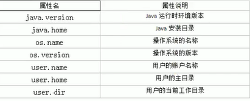


## 6. Math类

> java.lang.Math 提供了一系列竞态方法用于科学计算。其方法的参数和返回值类型一般为double型

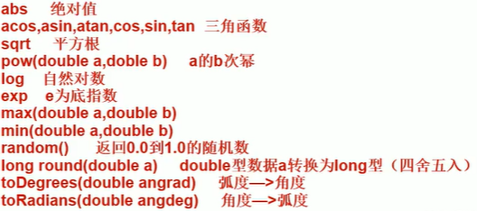


## 7. BigInteger 与 BigDecimal

### 7.1 BigInteger 

> `BigInteger`提供所有Java 的基本整数操作符的对应物，并提供`java.lang.Math` 的所有相关方法。另外，`BigInteger`还提供以下运算：模算术、GCD 计算、质数测试、素数生成、位操作以及一些其他操作。

1. 可以表示<font color='cornflowerblue'>不可变的任意精度的整数</font>

    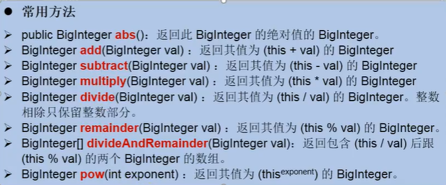


### 7.2 BigDecimal

1. 支持<font color='LightSeaGreen'>不可变的、任意精度的有符号十进制定点数</font>

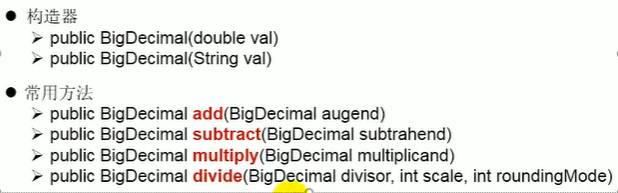

