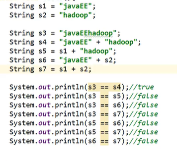

# Java常用类


## 1. 字符串相关的类

### 1.1 String类

#### 1.1 - 1 String 的特性

1. String 是一个final 类，代表不可变的字符序列

2. 字符串是常量，用双引号引起来表示。他们的值在创建之后不能更改

3. String对象的字符内容是存储在一个字符数组value[]中的

4. String字符串，使用一对“”引起来表示

5. String 声明为final 的，不可被继承

6. String 实现了Serializable接口：表示字符串是支持序列化的

​            实现了Comparable接口：表示String可以比较大小

7. String 内部定义了final char[] value 用于存储字符串数据

8. 体现： 
   - 当对字符串重新赋值时，需要重写指定内存区域赋值，不能使用原有的value进行赋值内存区域赋值
   - 当对现有的字符串进行连接操作时，也需要重新指定内存区域赋值，不能使用原有的value进行赋值内存区域赋值
   - 当调用String 的 replace()方法修改指定的字符或字符串时，不能使用原有的value进行赋值内存区域赋值

9. 通过字面量的方式（区别于new）给一个字符串赋值，此时的字符串值声明在字符串常量池中

10. 字符串常量池中是不会存储相同内容的字符串的

11. String对象的创建

    - 

12. String 的实例化

    - 方式一：通过字面量定义的方式：声明在方法区的字符串常量池中
    - 方式二：通过new + 构造器的方式 ： 是数据在堆空间中开辟空间以后对应的地址值

13. 面试题： String s = new String("abc");方式创建对象，在内存中创建了几个对象

    - 两个： 一个是堆空间中new结构，另一个是char[]对应的常量池中的数据：“abc”

14. 字符串拼接：

    

    - 结论
      - 常量与常量的拼接结果在常量池。且常量池中不会存在相同内容的常量
      - 只要其中有一个是变量，结果就在堆中
      - 如果拼接的结果调用intern()方法，返回值在常量池中


#### 1.1 - 2  String 的常用方法


#### 1.1 - 3 String 与 char[] 之间的转换

1. `str.toCharArray()`
2. String str = new String(arr)


#### 1.1 - 4  String 与 byte[] 之间的转换

1. `str.getBytes()`

2. 构造器

3. 解码时，要求解码使用的字符集必须与编码时使用的字符集一致

   

### 1.2 StringBuffer类

> java.lang.StringBuffer 代表可变的字符序列
>
> 


**String,StringBuffer,StringBuilder 三者的异同**

- String : 不可变的字符序列，底层使用 char[]
- StringBuffer ：可变的字符序列，线程安全的，效率低,底层使用char[]
- StringBuilder：可变的字符序列,线程不安全的，jdk 5.0新增,底层使用char[]


**常用方法**


### 

## 2. JDK 8 之前的日期时间API

1. java.lang.System类中的currentTimeMillis() : 

   - 返回当前时间与1970年1月1日0时0分0秒之间以毫秒为单位的时间差，称为`时间戳`

2. java.util.Date类

   - 构造器
     - Date() : 使用无参构造器创建的对象可以获取本地当前的时间
     - Date(long date)

   - 常用方法
     - getTime() : 返回自1970年1月1日0时0分0秒GMT 以来此Date对象表示的毫秒数
     - toString() : 把此Date对象转换为一下形式的String：dow mon dd hh : mm : ss :zzz : yyyy

3. java.sql.Date : 对应着数据库中的日期类型的变量

4. java.text.SimpleDateFormat类

5. java.util.Calender


## 3.JDK 8 中新日期时间API

1. java.time
2. java.time.chrono
3. java.time.format
4. java,time.temoral
5. java.time.zone


## 4. Java比较器

> 正常情况下，对于Java中的对象，我们只能比较： == 或 ！= ，不能使用 > 或 <
>
> 但是在开发场景中，我们需要对多个对象进行排序
>
> 如何实现？
>
> 使用一下两个接口中的任何一个 

### 4.1 Comparable 接口

> 自然排序

1. Comparable 接口的使用举例

   - 像String、包装类等实现了Comparable接口，重写了compareTo()方法，给出了比较两个对象比较大小的方式

   ```java
   public void test1(){
       String[] arr = new String[]{"AA","CC","KK","MM","GG","JJ","DD"};
       Arrays.sort(arr);
       System.out.println(arr.toString());
   }
   ```

2. 重写compareTo()的规则：
   - 如果当前对象this大于形参对象obj,则返回正整数，如果当前对象this 小于 形参对象obj,则返回负整数
3. 对于自定义类来说，如果需要排序，我们可以让自定义类实现Comparable接口，重写方法，在方法中说明如何排序

```java
    public int compareTo(Object o) {
        if(o instanceof Goods){
            Goods goods = (Goods) o;
            if(this.price > goods.price){
                return 1;
            }else if(this.price < goods.price){
                return -1;
            }else return 0;
//            return Double.compare(this.price,goods.price);
        }
        return 0;
//        throws new RuntimeException("传入类型不一致");
```


### 4.2 Comparator 接口

> 定制排序

1. Comparable 接口 与 Comparator 的使用对比
   - Comparable 接口一旦指定，能够保证Comparable 接口实现类的对象在任何位置都可以比较大小
   - Comparator 接口属于临时性的比较


## 5. System类

> System 类代表系统，系统级的很多属性和控制方法都放置在该类的内部
>
> 该类位于java.lang包
>
> 该类的构造器是private的，所以无法创建实例，
>
> 其内部成员和成员方法都是static的，所以也可以很方便的进行调用

1. 成员变量

   - in： 标准输入流
   - out ： 标准输出流
   - err ： 标准错误输出流

2. 成员方法：

   - native long currentTimeMillis() : 返回当前的计算机时间

   - void exit(int status) : 该方法的作用是退出程序

   - void gc() : 请求系统进行垃圾回收

   - String getProperty(String key) : 该方法的作用是获得系统中属性名为key的属性对应值

     


## 6. Math类

> java.lang.Math 提供了一系列竞态方法用于科学计算。其方法的参数和返回值类型一般为double型


## 7. BigInteger 与 BigDecimal

**BigInteger** 

1. 可以表示不可变的任意精度的整数
2. 


**BigDecimal**

1. 支持不可变的、任意精度的有符号十进制定点数


