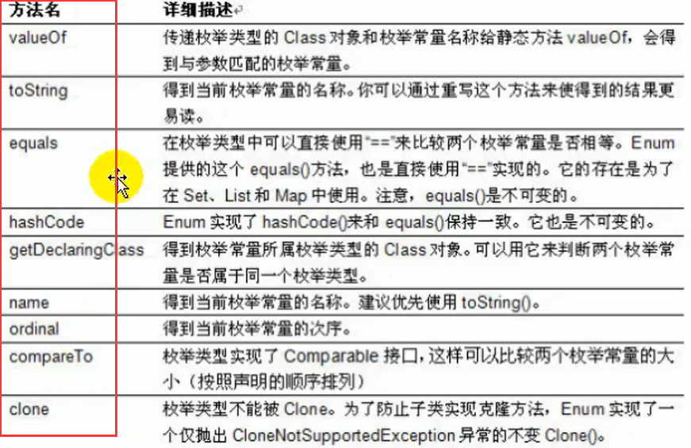
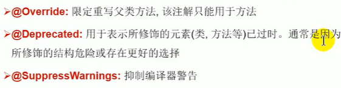
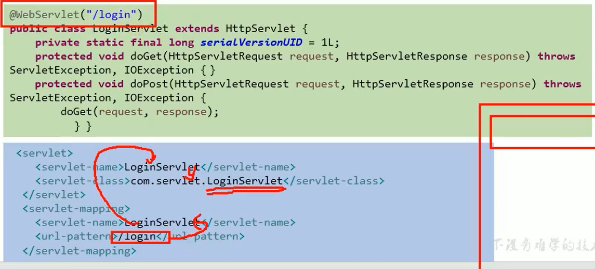
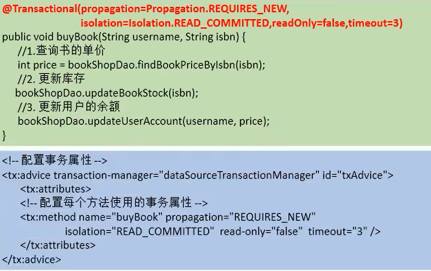
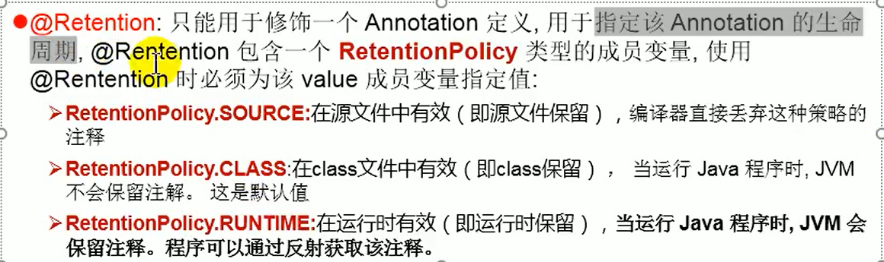
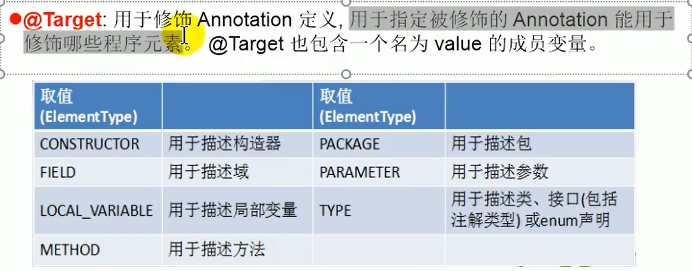
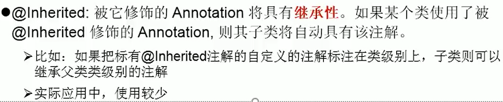
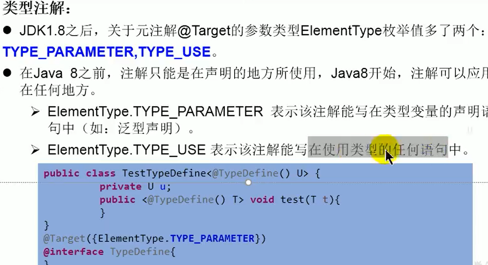

# 枚举类 & 注解


## 1. 枚举类

1. 理解：<font color='red'>类的对象只有有限个，确定的。</font>我们称此类为枚举类
    - 举例：星期：Monday(星期一)、…、Sunday(星期天)
2. 当需要定义一组常量的时候，强烈建议使用枚举类
3. 如果枚举类中只有一个对象，则可以作为单例模式的实现方式


**如何定义枚举类**

*方式一*：jdk5.0之前，<font color='orange'>自定义枚举类</font>

```java
//枚举类对象的属性不应允许被改动, 所以应该使用private final修饰
//枚举类的使用private final 修饰的属性应该在构造器中为其赋值
//若枚举类显式的定义了带参数的构造器, 则在列出枚举值时也必须对应的传入参数
class Season{
    //1.声明season对象的属性
    private final String seasoName;
    private final String seasonDesc;

    //2.私有化类的构造器
    private Season(String seasoName,String seasonDesc){
        this.seasoName = seasoName;
        this.seasonDesc = seasonDesc;
    }

    //3.提供当前枚举类的多个对象 ：public static final
    public static final Season Spring= new Season("春天","春暖花开");
    public static final Season Summer= new Season("夏天","夏日炎炎");
    public static final Season Autumn= new Season("秋天","秋高气爽");
    public static final Season Winter= new Season("冬天","冰天雪地");

    //4. 其他诉求 ： 获取枚举类对象的属性
    public String getSeasoName() {
        return seasoName;
    }

    public String getSeasonDesc() {
        return seasonDesc;
    }

    //4. 其他诉求 ： toString
    @Override
    public String toString() {
        return "Season{" +
                "seasoName='" + seasoName + '\'' +
                ", seasonDesc='" + seasonDesc + '\'' +
                '}';
    }
}
```


*方式二*：jdk5.0，可以使用<font color='green'>enum关键字</font>定义枚举类

> 定义的枚举类，默认继承于java.lang.Enum类，因此<font color='cornflowerblue'>不能再继承其他类</font>
>
> - 枚举类的所有实例必须在枚举类中显式列出(, 分隔; 结尾)。列出的实例系统会自动添加<font color='green'>public static final </font>修饰
> - 必须在枚举类的<font color='red'>第一行</font>声明枚举类对象

```java
enum Season1{
    Spring("春天","春暖花开"),
    Summer("夏天","夏日炎炎"),
    Autunm("秋天","秋高气爽"),
    Winter("冬天","冰天雪地");
    
    private final String seasonName;
    private final String seasonDesc;
    private Season1(String seasonName,String seasonDesc){
        this.seasonDesc = seasonDesc;
        this.seasonName = seasonName;
    }

}

public class SeasonTest1 {
    public static void main(String[] args) {
        Season1 summer = Season1.SUMMER;
        //toString():
        System.out.println(summer.toString());
        
        System.out.println(Season1.class.getSuperclass());
    }
}
```


**Enum类中的常用方法**



- <font color='DarkGoldenrod'>values() </font>:返回枚举类型的对象数组
- <font color='DarkGoldenrod'>valueOf(String str)</font>:可以把一个字符串转为对应的枚举类对象。要求字符串必须是枚举类对象的“名字”。如不是，会有运行时异常：IllegalArgumentException。
- <font color='DarkGoldenrod'>toString()</font>:返回当前枚举类对象常量的名称

```java
//values():返回所有的枚举类对象构成的数组
Season1[] values = Season1.values();
for(int i = 0;i < values.length;i++){
    System.out.println(values[i]);
}

Thread.State[] values1 = Thread.State.values();
for(int i = 0;i < values1.length;i++){
    System.out.println(values1[i]);
}
```

```java
//valueOf(String objName):返回枚举类中对象名是objName的对象。
Season1 winter = Season1.valueOf("WINTER");
//如果没有objName的枚举类对象，则抛异常：IllegalArgumentException
//Season1 winter = Season1.valueOf("WINTER1");
System.out.println(winter);
```


**使用enum关键字定义的枚举类实现接口的情况**

情况一 ： 实现接口，在enum类中实现抽象方法

情况二 ： 让枚举类的对象分别实现接口中的抽象方法

```java
//使用enum关键字枚举类
enum Season1 implements Info{
    //1.提供当前枚举类的对象，多个对象之间用","隔开，末尾对象";"结束
    SPRING("春天","春暖花开"){
        @Override
        public void show() {
            System.out.println("一元复始、万物复苏");
        }
    },
    SUMMER("夏天","夏日炎炎"){
        @Override
        public void show() {
            System.out.println("蝉声阵阵、烈日当空");
        }
    },
    AUTUMN("秋天","秋高气爽"){
        @Override
        public void show() {
            System.out.println("天高气清、金桂飘香");
        }
    },
    WINTER("冬天","冰天雪地"){
        @Override
        public void show() {
            System.out.println("寒冬腊月、滴水成冰");
        }
    };
    @Override
   public void show() {
       System.out.println("这是一个季节。");
    }
}
```


## 2. 注解


**注解（Annotation）概述**

1. Annotation其实就是代码里的特殊标记，这些标记可以在编译，类加载，运行时被读取，并执行相应的处理

2. Annotation 可以像修饰符一样被使用，可用于修饰包、类、构造器、方法、成员变量、参数、局部变量的声明

3. 框架 = 注解 + 反射 + 设计模式

4. 在JavaSE中，注解的使用目的比较简单，例如标记过时的功能，忽略警告等。在JavaEE、Android中注解占据了更重要的角色

   


**常见的Annotation示例**

1. 示例一：生成文档相关的注解

   

   

2. 示例二：在编译时进行格式检查(JDK内置的三个基本注解)

   


3. 跟踪代码依赖性，实现替代配置文件功能

   - Servlet3.0提供了注解，使得不再需要在web.xml文件中进行Servlet的部署

     

   - Spring框架中关于"事务"的管理

     


**自定义Annotation**

   参照@SuppressWarning 定义

1. 注解声明为： @interface
2. 内部定义成员，通常使用value表示
3. 可以指定成员的默认值，使用default定义
4. 如果自定义注解没有成员，表名是一个标识作用

如果注解有成员，需要指明成员的值

自定义注解必须配上注解的信息处理流程(使用反射)才有意义


**JDK中的元注解**

> JDK的元Annotation用于修饰其他Annotation定义
>
> 对现有的注解进行解释说明的注解

1. Retention

   

2. Target

   

3. Documented

   

4. Inherited

   


**利用反射获取注解信息**


**JDK8中注解的新特性**

1. 可重复注解

   - JDK8之前：MyAnnotations({@MyAnnotation(value="hi"),@MyAnnotation(value="hi")})

   - @Repeatable(MyAnnotations.class)

     Repeatable 和 MyAnnotations 两个的target相同

2. 类型注解

   - 

3. 