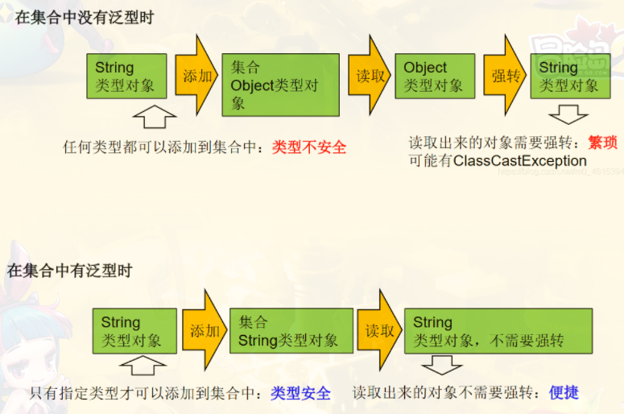
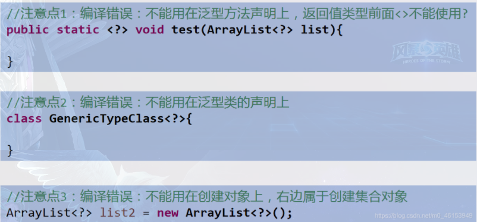

# 泛型

集合容器类在设计阶段/声明阶段不能确定这个容器到底实际存的是什么类型的对象，所以在<font color='cornflowerblue'>JDK1.5之前只能把元素类型设计为Object</font>，JDK1.5之后使用<font color='green'>泛型</font>来解决。因为这个时候除了元素的类型不确定，其他的部分是确定的，例如关于这个元素如何保存，如何管理等是确定的，因此<font color='orange'>此时把元素的类型设计成一个参数，这个类型参数叫做泛型。</font>Collection，List，ArrayList这个就是类型参数，即泛型。


## 1. 为什么要有泛型

> jdk5.0 新增特性

问题：

- <font color='green'>类型不安全</font>

    

- 强转时可能出现<font color='LightSeaGreen'>ClassCastException</font>


## 2. 在集合中使用泛型

> 编译时，就会进行类型检查，保证数据安全

1. 总结
   - 集合接口或集合类在jdk5.0时都修改为为带泛型的结构
   
   - 在实例化集合类中时，可以指明具体的泛型类型
   
   - 在指明完以后，在集合类或接口中凡是定义类或接口时，内部结构使用到泛型的位置，都实例化为指定的泛型类型
   
       *比如：add(E e)  --->实例化以后：add(Integer e)*
   
   - 注意点：泛型的类型必须是类，不能是基本数据类型
   
   - 如果实例化时没有指定泛型类型，默认为object类型


```java
//        Map<String,Integer> map = new HashMap<String,Integer>();
//        jdk7新特性：类型推断
```


## 3. 自定义泛型结构

> 泛型类，泛型接口，泛型方法

1. 如果定义了泛型类，实例化没有指明类的泛型，则认为此泛型类型为object类型

2. 要求： 如果大家定义了类是带泛型的，建议在示例化时要指明类的泛型

3. 

   


### 3.1 自定义泛型类

```java
//如果定义了泛型类，实例化没有指明类的泛型，，则认为此泛型类型为Object类型
//要求： 如果大家定义了类是带泛型的，建议实例化时要指明泛型的类型
public class Order<T>{
    String orderName;
    int orderId;
    //类的内部就可以使用类的泛型
    T orderT;
    public Order(){
        // 编译不通过 : T[] arr = new T[10];
        T[] arr = (T[]) new Object[10];
    };
    
    public Order(String orderName, int orderId, T orderT){
        this.orderName = orderName;
        this.orderId = orderId;
        this.orderT = orderT;
    }
    
    public T getOrderT(){
        return orderT;
    }
    
    public void setOrderId(T orderT){
        this.orderT = orderT;
    }
}
```


### 3.2 自定义泛型方法

> 方法中出现了泛型的结构，没有任何联系
>
> 泛型方法，可以声明为静态的。原因： 泛型参数是在调用方法时确定的，并非在实例化的时候确定的
>
> 泛型方法，可以声明为静态的 原因：泛型参数是在调用方法的时候确定的，并非在实例化类时确定

```java
<T> T[] toArray(T[] a);

public <E> List<E> copyFromArrayToList(E[] arr){
    ArrayList<E> list = new ArrayList<>();
    
    for(E e : arr){
        list.add(e);
    }
    return list;
}
```


**以下三个结构都不是泛型方法**

```java
public T getOrderT(){
    return orderT;
}

public void setOrderT(T orderT){
    this.orderT = orderT;
}

@Override
public String toString() {
    return "Order{" +
        "orderName='" + orderName + '\'' +
        ", orderId=" + orderId +
        ", orderT=" + orderT +
        '}';
}
```


## 4. 泛型在继承上的体现

1. 虽然类A 是 类B 的父类， 但是G<A> 和 G<B> 二者不具备子父类关系，二者是并列关系

   补充： 类A 是 类 B 的，A<G> 是 B<G> 的父类


## 5. 通配符的使用

> 通配符 ： ？

```java
//List<?>是List、List等各种泛型List的父类。

List<?> list = null;
```

1. 类A 是 类B 的父类， G<A> 和G<B> 是没有关系的，二者共同的父类是： G<?>
2. 添加 ： 对于List<?> 就不能向其内部添加数据，除了null
3. 读取(写入) ： 允许读取数据，读取的类型为object



```java
import org.junit.Test;

import java.util.AbstractList;
import java.util.ArrayList;
import java.util.Iterator;
import java.util.List;

/**
 * 1.泛型在继承方面的体现
 * 2.通配符的使用
 */
public class GenericTest {

    @Test
    public void test3(){
        List<Object> list1 = null;
        List<String> list2 = null;

        List<?> list = null;

        list = list1;
        list = list2;

        //编译通过
        print(list1);
        print(list2);
    }

    public void print(List<?> list){
        Iterator<?> iterator = list.iterator();
        while(iterator.hasNext()){
            Object obj = iterator.next();
            System.out.println(obj);
        }
    }
}

```


**有限制条件的通配符的使用**

 ? extends Person:

​						G<? extends A> 可以作为G<A> 和 G<B> 的父类的，， 其中 B是 A的子类，即<=

? extends Person:

​						G<? super A> 可以作为G<A> 和 G<B> 的父类的，， 其中 A是 B的子类,即>=


## 6. 泛型应用举例

1. 泛型嵌套

    ```java
    public static void main(String[] args) {
            HashMap<String, ArrayList<Citizen>> map= new HashMap<String, ArrayList<Citizen>>();
            ArrayList<Citizen> list= new ArrayList<Citizen>();
            list.add(new Citizen("刘恺威"));
            list.add(new Citizen("杨幂"));
            list.add(new Citizen("小糯米"));
            map.put("刘恺威", list);
            Set<Entry<String, ArrayList<Citizen>>> entrySet= map.entrySet();
            Iterator<Entry<String, ArrayList<Citizen>>> iterator= entrySet.iterator();
            while(iterator.hasNext()) {
                Entry<String, ArrayList<Citizen>> entry= iterator.next();
                String key= entry.getKey();
                ArrayList<Citizen> value= entry.getValue();
                System.out.println("户主："+ key);
                System.out.println("家庭成员："+ value);
            }
        }
    
    ```

    
