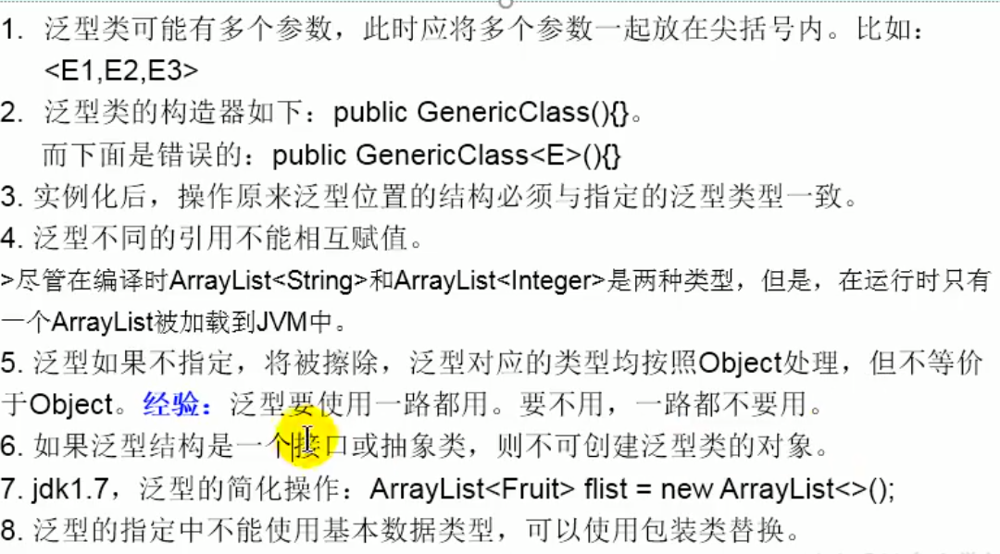
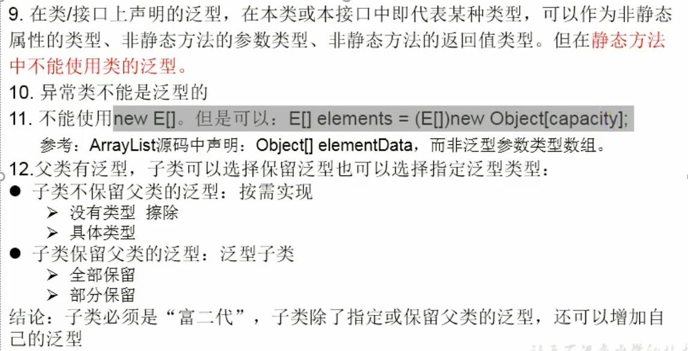

# 泛型

## 1. 为什么要有泛型

> jdk5.0 新增特性

问题：

- 类型不安全
- 强转时可能出现ClassCastException


## 2. 在集合中使用泛型

> 编译时，就会进行类型检查，保证数据安全

1. 总结
   - 集合接口或集合类在jdk5.0时都修改为为带泛型的结构
   - 在实例化集合类中时，可以指明具体的泛型类型
   - 在指明完以后，在集合类或接口中凡是定义类或接口时，内部结构使用到泛型的位置，都实例化为指定的泛型类型
   - 注意点：泛型的类型必须是类，不能是基本数据类型
   - 如果实例化时没有指定泛型类型，默认为object类型


## 3. 自定义泛型结构

> 泛型类，泛型接口，泛型方法

1. 如果定义了泛型类，实例化没有指明类的泛型，则认为此泛型类型为object类型

2. 要求： 如果大家定义了类是带泛型的，建议在示例化时要指明类的泛型

3. 

   


### 3.1 自定义泛型类

```java
public class Order<T>{
    String orderName;
    int orderId;
    //类的内部就可以使用类的泛型
    T orderT;
    public Order(){};
    
    public Order(String orderName, int orderId, T orderT){
        this.orderName = orderName;
        this.orderId = orderId;
        this.orderT = orderT;
    }
}
```


### 3.2 自定义泛型方法

> 方法中出现了泛型的结构，泛型参数与类的泛型参数没有任何联系
>
> 泛型方法，可以声明为静态的。原因： 泛型参数是在调用方法时确定的，并非在实例化的时候确定的

```java
<T> T[] toArray(T[] a);
```


## 4. 泛型在继承上的体现


## 5. 通配符的使用


## 6. 泛型应用举例

