# 反射

## 1. Java反射机制概述

Reflectiion 是被视为<font color='DarkGoldenrod'>动态语言</font>的关键，反射机制允许程序在执行期借助于Reflection API 取得任何类的内部信息，并能直接操作任意对象的内部属性及方法


==反射== ： 加载完类后，在堆内存的方法区中就产生了一个Class类型的对象（一个类只有一个Class对象），这个对象就包含了完整的类的结构信息。我们可以通过过这个对象看到类的结构。


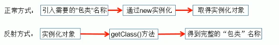


> ##### 动态语言 vs 静态语言

1. <font color='orange'>动态语言 </font>

    在运行时可以改变其结构的语言： 如，新的函数、对象甚至代码可以被引进，已有的函数可以被删除或是其他结构上的变化。

    即，<font color='cornflowerblue'>在运行时代码可以根据某些条件改变自身结构</font>

    <font color='DarkGoldenrod'>主要的动态语言</font>：Object-C、C#、JavaScript、PHP、python、Erlang


2. <font color='orange'>静态语言</font>

    <font color='cornflowerblue'>运行时结构不可变的语言</font>

    <font color='DarkGoldenrod'>如</font>：Java、 C、 C++


*Java不是动态语言，但可称之为“准动态语言”。即Java有一定的动态性，我们可以利用反射机制、字节码操作获得类似动态语言的特性*


> ##### 反射机制研究及应用

1. Java反射机制提供的<font color='green'> 功能</font>
    - 在运行时判断任意一个对象所属的类
    - 在运行时构造任意一个类的对象
    - 在运行时判断任意一个类所具有的成员变量和方法
    - 在运行时获取泛型的信息
    - 在运行时调用任意一个对象的成员变量和方法
    - 在运行时处理注释
    - 生成动态代理


2. 反射中主要的<font color='purple'> API </font>
    - java.lang.Class : 代表一个类
    - java.lang.reflect.Method : 代表类的方法
    - java.lang.reflect.Field : 代表类的成员变量
    - java.lang.reflect.Constructor : 代表类的构造器


> ##### 使用反射

```java
public void test2() throws Exception{
    Class clazz = Person.class;
    //1. 通过反射，创建Person类的对象
    Constructor cons = clazz.getConstructor(String.class, int.class);
    Object obj = cons.newInstance("tom", 12);
    Person p = (Person) obj;
    System.out.println(p.toString());
    
    //2. 通过反射，调用对象指定的属性、方法
    Field age = clazz.getDeclaredField("age");
    age.set(p, 10);
    System.out.println(p.toString());
    
    Method show = clazz.getDeclaredMethod("show");
    show.invoke(p);
    
    //通过反射，可以调用Person类的私有结构，如，私有的构造器、方法、属性
    Constructor cons1 = clazz.getDeclaredConstructor(String.class);
    cons1.setAccessible(true);
    Person p1 = (Person) cons1.newInstance("Jerry");
    System.out.println(p1);
    Field name = clazz.getDeclaredField("name");
    name.setAccessible(true);
    name.set(p1, "HanMeiMei");
    
    Method showNation = clazz.getDeclaredMethod("showNation", String.class);
    showNation.setAccessible(true);
    String nation = (String)showNation.invoke(p1, "中国");
    System.out.println(nation);
}
```


> ##### 如何理解反射和封装性

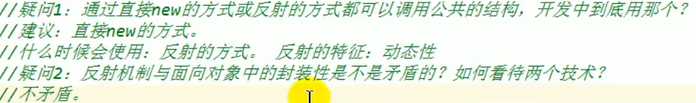


## 2.  理解Class类并获取Class实例

> ##### Class 类的理解

1. <font color='cornflowerblue'>类的加载过程</font> ： 程序经过javac.exe 命令以后， 会生成一个或多个字节码文件(.class结尾)，接着我们使用java.exe 命令对某个字节码文件进行解释运行 ，相当于将某个字节码文件加载到内存中
    - <font color='LightSeaGreen'>运行时类</font> ： 加载到内存中的类
    - 此运行时类，就作为<font color='LightSeaGreen'>Class的一个实例</font>，即，Class的实例就对应着一个运行时类
    - 加载到内存中的运行时类，会缓存一定的时间。在此时间内，我们可以通过不同的方式来获取此运行时类


> ##### 获取Class 实例的 4 种方式

```java
@Test
public void test3() throws ClassNotFoundException {
    // 方式一：调用运行时类的属性，“.class”
    Class<Person> clazz1 = Person.class;
    System.out.println(clazz1);

    //方式二： 通过运行时类的对象
    Person p1 = new Person();
    Class clazz2 = p1.getClass();
    System.out.println(clazz2);

    //*方式三： 调用Class的静态方法： forName(String classPath)
    Class clazz3 = Class.forName("Person");
    Class clazz31 = Class.forName("java.lang.String");
    System.out.println(clazz3+""+""+clazz31);

    System.out.println(clazz1 == clazz2);
    System.out.println(clazz2 == clazz3);

    //方式四：使用类的加载器：ClassLoader(了解)
    ClassLoader classLoader = reflect.class.getClassLoader();
    Class clazz4 = classLoader.loadClass("Person");
    System.out.println(clazz4);

    System.out.println(clazz1 == clazz4);
}
```

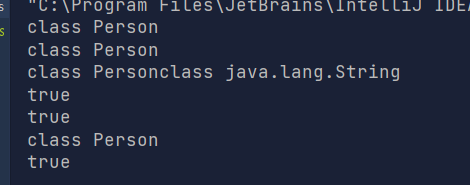


> ##### Class 实例对应的结构说明

1. 哪些类型是可以有Class对象

    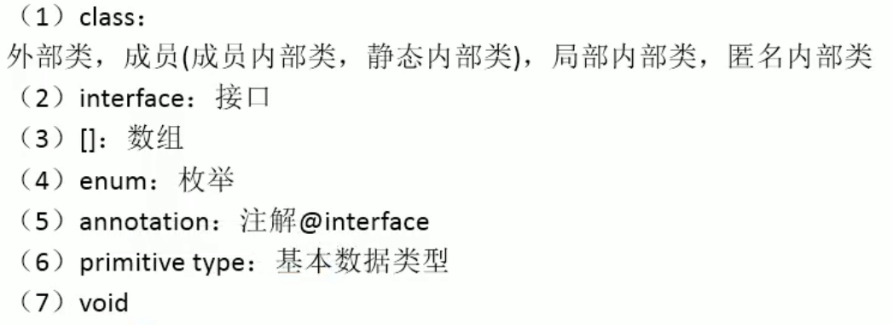


2. 注：
    - 只要数组的元素类型与维度一样，就是同一个Class


## 3.  类的加载与ClassLoader的理解

（了解）

> ##### 类的加载过程

当程序主动使用某个类时，如果该类还未被加载到内存中，则系统会通过如下 *三个步骤* 来对该<font color='orange'>类进行初始化</font>

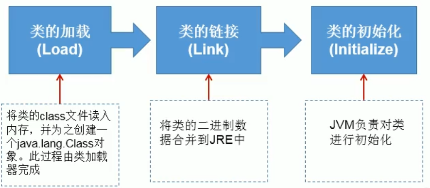

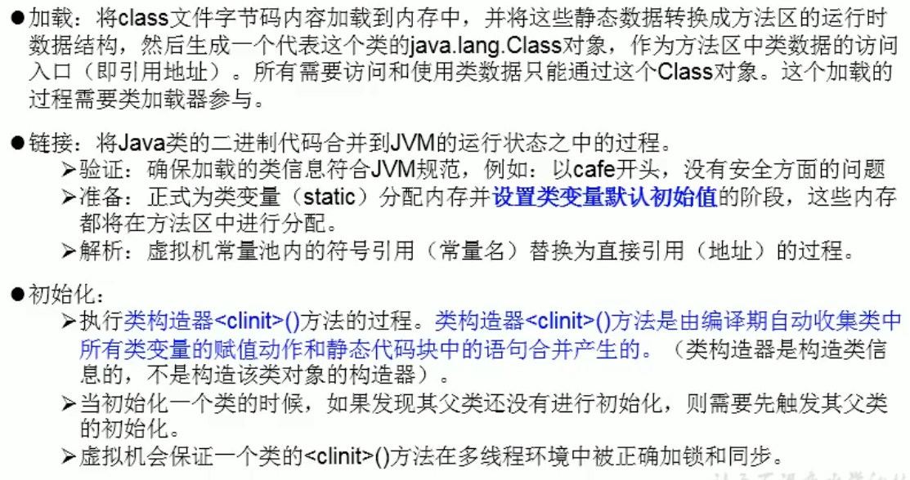


> ##### 了解：ClassLoader

1. <font color='DarkGoldenrod'>类加载器的作用：</font>
    - <font color='green'>类加载的作用：</font>将class文件字节码内容加载到内存中，并将这些静态数据转换成方法区的运行时数据结构，然后再堆中生成一个代表这个类的java.lang.Class对象，作为方法区中类数据的访问入口
    - <font color='green'>类缓存：</font>标准的JavaSE类加载器可以按要求查找类，但一旦某个类被加载到类加载器中，它将维持加载(缓存)一段时间。不过JVM垃圾回收机制可以回收这些Class对象
    - 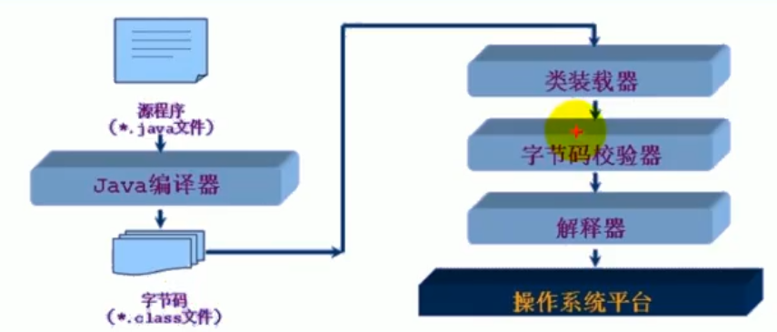


2. <font color='DarkGoldenrod'>类加载器的作用 ：</font> 是把类装载进内存

    

3. JVM规范类如下类型的类的加载器

    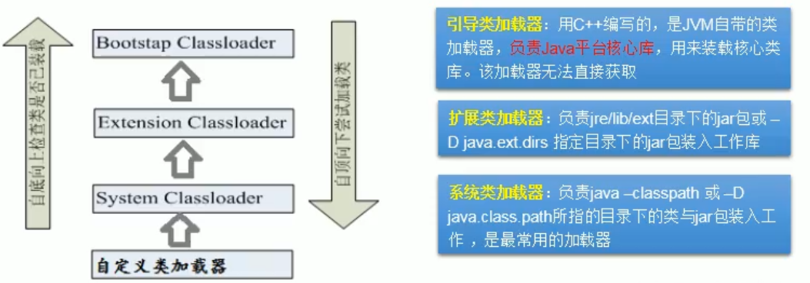

    ```java
    @Test
    public void test1(){
        //对于自定义类，使用系统类加载器进行加载
        ClassLoader classLoader = reflect.class.getClassLoader();
        System.out.println(classLoader);
    
        //调用系统类加载器的getParent() : 获取扩展类加载器
        ClassLoader classLoader1 = classLoader.getParent();
        System.out.println(classLoader1);
    
        //调用扩展类加载器的getParent() : 无法获取引导类加载器
        //引导类加载器主要负责加载Java核心类库，无法加载自定义类
        ClassLoader classLoader2 = classLoader1.getParent();
        System.out.println(classLoader2);
        
    }
    ```


3. 使用 ClassLoader 加载配置文件

    ```java
    @Test
    public void test4() throws IOException {
        Properties pros = new Properties();
    
        //        此时的文件默认在当前的module下
        //        读取配置文件的方式一：
    
        //        FileInputStream fis = new FileInputStream("jdbc.properties");
        //        FileInputStream fis = new FileInputStream("src\\jdbc1.properties");
        //        pros.load(fis);
    
        //读取配置文件的方式二：使用classLoader
        //注意：配置文件默认识别为：当前module的src下
        ClassLoader classLoader = reflect.class.getClassLoader();
        InputStream is = classLoader.getResourceAsStream("jdbc1.properties");
        pros.load(is);
    
        String user = pros.getProperty("user");
        String password = pros.getProperty("password");
        System.out.println("user = " + user + ",password" + password);
    
    }
    ```

    


## 4. 创建运行时类的对象


> ##### 创建运行时类的对象

```java
@Test
public void test1() throws IllegalAccessException, InstantiationException {

    Class<Person> clazz = Person.class;
    /*
    * newInstance():调用此方法，创建对应的运行时类的对象
    * 内部调用了运行时类的空参构造器
    * 要想此方法正常的创建运行时类的对象，要求：
    * 1. 运行时类必须提供空参构造器
    * 2. 空参构造器的访问权限要够。通常设置为public
    *
    *  在Javabean 中要求提供 一个 public 的空参构造器。
    * 1. 便于通过反射，创建运行时类的对象
    * 2. 便于子类继承此运行时类时，默认调用super()时，保证父类由此构造器
    *
    **/
    Person obj = clazz.newInstance();
    System.out.println(obj);
}
```


> 体会反射的动态性

```java
@Test
public void test2(){
    int num = new Random().nextInt(3); //0,1,2
    String classPath = "";
    switch (num){
        case 0:
            classPath = "java.util.Date";
            break;
        case 1:
            classPath = "java.lang.Object";
            break;
        case 3:
            classPath = "Person";
            break;
    }
    try {
        Object obj = getInstance(classPath);
    } catch (ClassNotFoundException e) {
        e.printStackTrace();
    } catch (IllegalAccessException e) {
        e.printStackTrace();
    } catch (InstantiationException e) {
        e.printStackTrace();
    }

}

/*
*创建一个指定类的对象
* classPath ： 指定类的全类名
*
**/
public Object getInstance(String classPath) throws ClassNotFoundException, IllegalAccessException, InstantiationException {
    Class clazz = Class.forName(classPath);
    return clazz.newInstance();
}
```


## 5. 获取运行时类的完整结构

> ##### 获取运行时类的属性

```java
public class FieldTest {

    @Test
    public void test1(){

        Class clazz = Person.class;

        //获取属性结构
        //getFields(): 获取当前运行时类及其父类中声明为public访问权限的属性
        Field[] fields = clazz.getFields();
        for (Field f : fields){
            System.out.println(f);
        }

        //getDeclaredFields() : 获取当前运行时类中声明的所有属性。（不包含父类中声明的属性）
        Field[] fields1 = clazz.getDeclaredFields();
        for (Field f:
             fields1) {
            System.out.println(f);
        }

    }

    //权限修饰符 数据类型 变量名
    @Test
    public void test2(){

        Class clazz = Person.class;
        Field[] fields1 = clazz.getDeclaredFields();
        for (Field f:
                fields1) {
            //1.权限修饰符
            int modifiers = f.getModifiers();
            System.out.println(Modifier.toString(modifiers));

            //2. 数据类型
            Class type = f.getType();
            System.out.println(type.getName());

            //3. 变量名
            f.getName();

            System.out.println(f);
        }

    }
}
```

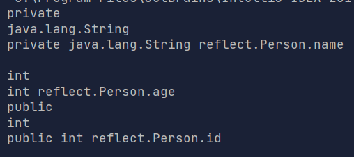


> ##### 获取运行时类的方法结构

```java
public class MethodTest {

    @Test
    public void test1(){

        Class clazz = Person.class;

        //getMethods() : 获取当前运行时类及其搜游父类中声明为public的方法
        Method[] methods = clazz.getMethods();
        for (Method m : methods){
            System.out.println(m);
        }

        System.out.println();

        // getDeclaredMethods() : 获取当前运行时类中声明的所有方法，不包含父类中的
        Method[] declareMethods = clazz.getDeclaredMethods();
        for(Method m : declareMethods){
            System.out.println(m);
        }
    }

    /**
     * @XX
     * 权限修饰符 返回值类型 方法名（参数类型。。。） throws XxxException{}
    **/
    @Test
    public void test2(){

        Class clazz = Person.class;
        Method[] declareMethods = clazz.getDeclaredMethods();
        for(Method m : declareMethods){

            //1. 获取方法声明的注解
            Annotation[] annos = m.getAnnotations();
            for (Annotation a : annos){
                System.out.println(a);
            }

            //2. 权限修饰符
            System.out.println(Modifier.toString(m.getModifiers()));
            System.out.println();

            //3. 返回值类型
            System.out.println(m.getReturnType().getName());
            System.out.println();

            //4. 方法名
            System.out.println(m.getName());

            //5. 形参列表
            Class[] parameterTypes = m.getParameterTypes();
            if(!(parameterTypes == null && parameterTypes.length == 0)){
                for(Class p : parameterTypes){
                    System.out.println(p.getName() + "args_");
                }
            }

            //6. 抛出的异常
            Class[] exceptionTypes = m.getExceptionTypes();


            System.out.println(m);
        }
    }

}
```


> ##### 获取运行时类的构造器结构

```java
/*
 获取构造器结构
 */
 @Test
 public void test1(){

     Class clazz = Person.class;
     //getConstructors() : 获取当前运行时类中声明为public的构造器
     Constructor[] constructors = clazz.getConstructors();
     for(Constructor c : constructors){
         System.out.println(c);
     }
     System.out.println();
     //getDeclaredConstructors() : 获取当前运行时类中声明的所有的构造器
     Constructor[] constructors1 =clazz.getDeclaredConstructors();

 }
```


> ##### 获取运行时类的父类及父类泛型  

```java
/*
获取运行时类的父类
**/
@Test
public void test2(){
    Class clazz = Person.class;
    Class superclass = clazz.getSuperclass();
    System.out.println(superclass);
}

/*
获取运行时类的带泛型的父类
**/
@Test
public void test3(){
    Class clazz = Person.class;
    Type superclass = clazz.getGenericSuperclass();
    System.out.println(superclass);
}

/*
获取运行时类的带泛型的父类的泛型
**/
@Test
public void test4(){
    Class clazz = Person.class;
    Type superclass = clazz.getGenericSuperclass();
    ParameterizedType parameterizedType = (ParameterizedType) superclass;
    //获取泛型类型
    Type[] actualTypeArguments = parameterizedType.getActualTypeArguments();
    System.out.println(actualTypeArguments[0].getTypeName());
    System.out.println(((Class)actualTypeArguments[0]).getTypeName());
}
```


> ##### 获取运行时类的接口、所在包、注解等

```java
/*
获取运行时类的接口
**/
@Test
public void test5(){
    Class clazz = Person.class;

    Class[] interfaces = clazz.getInterfaces();
    for(Class c : interfaces){
        System.out.println(c);
    }
    //获取运行时类父类的接口
    Class[] interfaces1 = clazz.getSuperclass().getInterfaces();
    for (Class c : interfaces1){
        System.out.println(c);
    }
}

/*
获取运行时类所在的包
**/
@Test
public void test6(){
    Class clazz = Person.class;
    Package aPackage = clazz.getPackage();
    System.out.println(aPackage);
}

/*
获取运行时类的注解
**/
@Test
public void test7(){
    Class clazz = Person.class;
    Annotation[] annotations = clazz.getAnnotations();
    for (Annotation annos : annotations){
        System.out.println(annos);
    }
}
```


## 6. 调用运行时类的指定结构

> ##### 调用运行时类的指定属性

```java
@Test
public  void testField() throws NoSuchFieldException, IllegalAccessException, InstantiationException {
    Class clazz = Person.class;

    //创建运行时类的对象
    Person p = (Person) clazz.newInstance();

    //获取指定的属性 ： 要求运行时类的属性声明为public，不常用
    Field id = clazz.getField("id");

    //设置当前属性的值
    /*
    set():参数1 ：指明设置哪个对象的属性
          参数2 ：将此属性设置为多少
    **/
    id.set(p, 1001);

    /*
    获取当前属性的值
    get() : 参数1 获取哪个对象的当前属性值
    **/
    id.get(p);
}

@Test
public void testField1() throws IllegalAccessException, InstantiationException, NoSuchFieldException {
    Class clazz = Person.class;

    //创建运行时类的对象
    Person p = (Person) clazz.newInstance();

    //getDeclaredField(String name): 获取运行时类中指定变量名的属性
    Field name = clazz.getDeclaredField("name");

    //保证当前属性是可访问的
    name.setAccessible(true);
    name.set(p, name);
    System.out.println(name.get(p));
}
```


> ##### 调用运行时类中的指定方法

```java
@Test
public void testMethod() throws IllegalAccessException, InstantiationException, NoSuchMethodException, InvocationTargetException {

    Class clazz = Person.class;

    //创建运行时类的对象
    Person p = (Person)clazz.newInstance();

    //获取指定的某个方法
    //getDeclaredMethods() : 参数1 ：指明获取方法的名称 参数2 ：指明获取的方法的形参列表
    Method shows = clazz.getDeclaredMethod("show", String.class);

    shows.setAccessible(true);
    //invoke(): 参数1 ：方法的调用者 参数2 ：给方法形参赋值的实参
    //invoke()方法的返回值即为对应类中调用的方法的返回值
    //如郭调用的运行时类的方法没有返回值，则invoke()返回null
    Object returnValue = shows.invoke(p, "CHN");
    System.out.println(returnValue);

    System.out.println("*****如何调用静态方法****");
    //同上
    //showDesc.invoke(Person.clss);  也可写null
}
```


> ##### 调用运行时类中的指定构造器

```java
@Test
public void testConstructor() throws NoSuchMethodException, IllegalAccessException, InvocationTargetException, InstantiationException {
    Class clazz = Person.class;

    /**
     * 1.获取指定的构造器
     *  getDeclaredConstructor(): 参数 ：指明构造器的参数列表
    **/

    Constructor declaredConstructors = clazz.getDeclaredConstructor(String.class);

    //2.保证此构造器是可访问的
    declaredConstructors.setAccessible(true);

    //3.调用此构造器创建运行时类的对象
    Person o = (Person)declaredConstructors.newInstance("Tom");
    System.out.println(o);
}
```


## 7. 反射的应用 ：动态代理

> ##### 代理设计模式的原理

使用一个代理将对象包装起来，然后用该代理对象取代原始对象。任何对原始对象的调用都要通过代理。代理对象决定是否以及何时将方法当调用转到原始对象上


> ##### 静态代理举例

```java
/*
*@author  ZJH
*@Date 13:39 2022/1/13
*@Description : 静态代理举例
*
* 特点 ：代理类和被代理类在编译期间，就确定下来了
**/

interface ClothFactory {

    void produceCloth();

}

//代理类
class ProxyClothFactory implements ClothFactory{

    private ClothFactory factory; //用被代理类对象进行实例化

    public ProxyClothFactory(ClothFactory factory){
        this.factory = factory;
    }

    @Override
    public void produceCloth() {
        System.out.println("代理工厂做一些准备工作");

        factory.produceCloth();

        System.out.println("代理工厂做一些后续的首尾工作");
    }
}

//被代理类
class NikeClothFactory implements ClothFactory{

    @Override
    public void produceCloth() {
        System.out.println("Nike工厂生产一批运动服");
    }
}

public class StaticProxyTest{
    public static void main(String[] args) {
        //创建被代理类的对象
        NikeClothFactory nike = new NikeClothFactory();

        //创建代理类的对象
        ProxyClothFactory proxyClothFactory = new ProxyClothFactory(nike);

        proxyClothFactory.produceCloth();
    }
}
```

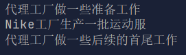


> ##### 动态代理举例

```java
package proxy;

import java.lang.reflect.InvocationHandler;
import java.lang.reflect.Method;
import java.lang.reflect.Proxy;

/**
 * @Author: ZJH
 * @Date: 2022/01/13/13:42
 * @Description:
 */

interface Human{

    String getBelief();

    void eat(String food);

}

//被代理类
class SuperMan implements Human{

    @Override
    public String getBelief() {
        return "超人的信仰";
    }

    @Override
    public void eat(String food) {
        System.out.println("我喜欢吃" + food);
    }
}

/*
要想实现动态代理，需要解决的问题？
问题一:如何根据加载到内存中的被代理类，动态创建一个代理类及其对象
问题二:当通过代理类的对象调用方法时，如何动态的去调用被代理类中的同名方法
*/

class ProxyFactory{
    //调用此方法返回一个代理类的对象，解决问题1
    public static Object getProxyInstance(Object obj){ //obj ：被代理类的对象

        MyInvocationHandler handler = new MyInvocationHandler();

        handler.bind(obj);

        return Proxy.newProxyInstance(obj.getClass().getClassLoader(), obj.getClass().getInterfaces(), handler);

    }

}

class MyInvocationHandler implements InvocationHandler{

    //需要使用被代理类的对象进行赋值
    private Object obj;

    public void bind(Object obj){
        this.obj = obj;
    }

    //当通过代理类的对象，调用方法A时，就会自动的调用如下的方法 : invoke()
    //将被代理类要执行的方法A的功能就声明在invoke()中
    @Override
    public Object invoke(Object o, Method method, Object[] objects) throws Throwable {

        //method : 即为代理类对象调用的方法，此方法也就作为了被代理类对象要调用的方法
        //obj: 被代理类的对象
        Object returnValue = method.invoke(obj, objects);
        //代理对象调用方法的返回值
        return returnValue;

    }
}

public class ProxyTest {

    public static void main(String[] args) {

        SuperMan superMan = new SuperMan();
        //proxyInstance : 代理类的对象
        Human proxyInstance = (Human)ProxyFactory.getProxyInstance(superMan);
        //当通过代理类对象调用方法时，会自动的调用被代理类中的同名方法
        proxyInstance.getBelief();
        proxyInstance.eat("煎蛋");

        NikeClothFactory nikeClothFactory = new NikeClothFactory();
        ClothFactory proxyInstance1 = (ClothFactory) ProxyFactory.getProxyInstance(nikeClothFactory);
        proxyInstance1.produceCloth();

    }

}
```

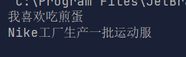


> ##### 动态代理与AOP(Aspect Orient Programming)

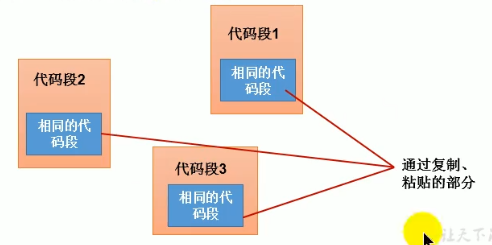

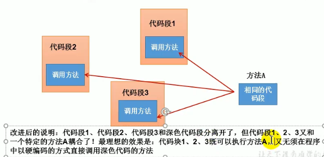

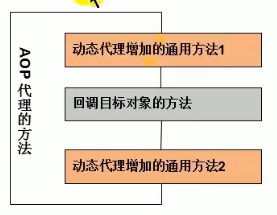

```java
class HumanUtil{

    public void method1(){
        System.out.println("通用方法1");
    }

    public void method2(){
        System.out.println("通用方法2");
    }

}

//当通过代理类的对象，调用方法A时，就会自动的调用如下的方法 : invoke()
//将被代理类要执行的方法A的功能就声明在invoke()中
@Override
public Object invoke(Object o, Method method, Object[] objects) throws Throwable {

    HumanUtil util = new HumanUtil();
    util.method1();
    //method : 即为代理类对象调用的方法，此方法也就作为了被代理类对象要调用的方法
    //obj: 被代理类的对象
    Object returnValue = method.invoke(obj, objects);
    //代理对象调用方法的返回值
    util.method2();
    return returnValue;

}
```
